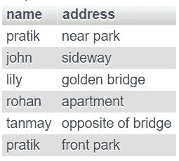
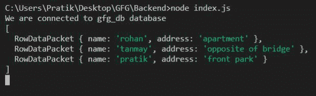

# Node.js MySQL 限制条款

> 原文:[https://www.geeksforgeeks.org/node-js-mysql-limit-clause/](https://www.geeksforgeeks.org/node-js-mysql-limit-clause/)

LIMIT 子句用于设置 SQL 查询输出中的最大行数。

**语法:**

*   从用户表的第一行中仅选择 3 行。

    ```
    SELECT * FROM users LIMIT 3
    ```

*   从用户表的第二行中仅选择 3 行。

    ```
    SELECT * FROM users LIMIT 3 OFFSET 1
    ```

**模块:**

*   mysql:处理 MySql 连接和查询

```
npm install mysql
```

**SQL 用户表预览:**



**示例 1:** 从用户表的第一行中选择 3 行

## java 描述语言

```
const mysql = require("mysql");

let db_con  = mysql.createConnection({
    host: "localhost",
    user: "root",
    password: '',
    database: 'gfg_db'
});

db_con.connect((err) => {
    if (err) {
      console.log("Database Connection Failed !!!", err);
      return;
    }

    console.log("We are connected to gfg_db database");

    // here is our query
    let query = 'SELECT * FROM users LIMIT 3';

    db_con.query(query, (err, rows) => {
        if(err) throw err;

        console.log(rows);
    });
});
```

**输出:**


**示例 2:** 从用户表的第 4 行中选择 4 行

## java 描述语言

```
const mysql = require("mysql");

let db_con  = mysql.createConnection({
    host: "localhost",
    user: "root",
    password: '',
    database: 'gfg_db'
});

db_con.connect((err) => {
    if (err) {
      console.log("Database Connection Failed !!!", err);
      return;
    }

    console.log("We are connected to gfg_db database");

    // notice offset is 3, this means choose from row 4
    let query = 'SELECT * FROM users LIMIT 4 OFFSET 3';

    db_con.query(query, (err, rows) => {
        if(err) throw err;

        console.log(rows);
    });
});
```

**输出:**距离第 4 行只有 3 行。因此，输出只包含 3 行

