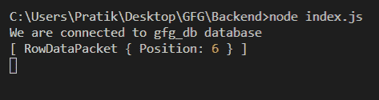
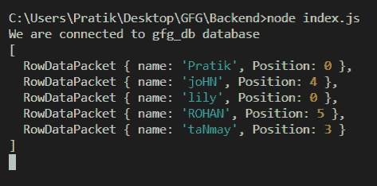

# Node.js MySQL LOCATE()函数

> 原文:[https://www . geesforgeks . org/node-js-MySQL-locate-function/](https://www.geeksforgeeks.org/node-js-mysql-locate-function/)

**LOCATE()** 函数是 MySQL 中的一个内建函数，用于从特定位置搜索时获取文本中某个模式第一次出现的位置。

**注意:**不区分大小写。

**语法:**

```
LOCATE(pattern, text, starting_position)
```

**参数:** LOCATE()函数接受三个参数，如上所述，如下所述。

*   **模式:**要搜索的模式
*   **文本:**在这个文本模式中将被搜索
*   **起始位置(可选):**搜索将从该位置开始。默认值为 1。

**返回值:** LOCATE()函数返回从特定位置搜索时文本中第一个模式出现的位置。如果出现问题，它将返回 0。

**模块:**

*   **mysql:** 处理 mysql 连接和查询

```
npm install mysql
```

**SQL 发布者表预览:**


**例 1:**

## java 描述语言

```
const mysql = require("mysql");

let db_con = mysql.createConnection({
  host: "localhost",
  user: "root",
  password: "",
  database: "gfg_db",
});

db_con.connect((err) => {
  if (err) {
    console.log("Database Connection Failed !!!", err);
    return;
  }

  console.log("We are connected to gfg_db database");

  // here is the query
  let query = `SELECT LOCATE('for', 'GeeksForGeeks', 3) AS Position`;

  db_con.query(query, (err, rows) => {
    if (err) throw err;

    console.log(rows);
  });
});
```

**输出:**



**例 2:**

## java 描述语言

```
const mysql = require("mysql");

let db_con = mysql.createConnection({
  host: "localhost",
  user: "root",
  password: "",
  database: "gfg_db",
});

db_con.connect((err) => {
  if (err) {
    console.log("Database Connection Failed !!!", err);
    return;
  }

  console.log("We are connected to gfg_db database");

  // here is the query
  let query = `SELECT name, LOCATE('n', name) AS Position FROM publishers`;

  db_con.query(query, (err, rows) => {
    if (err) throw err;

    console.log(rows);
  });
});
```

**输出:**

