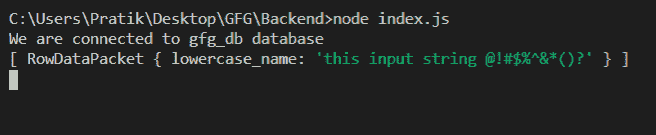
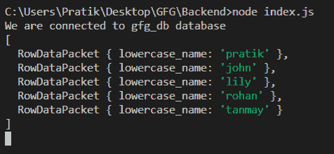

# Node.js MySQL LOWER()函数

> 原文:[https://www.geeksforgeeks.org/node-js-mysql-lower-function/](https://www.geeksforgeeks.org/node-js-mysql-lower-function/)

**LOWER()** 函数是 MySQL 中的一个内置函数，用于将给定字符串的所有字符转换为小写。

**语法:**

```
LOWER(input_string)
```

**参数:** LOWER()函数接受单个参数，如上所述，如下所述。

*   **input_string:** 我们将把这个字符串转换成小写

**返回值:** LOWER()函数返回一个新的小写字符串。

**模块:**

*   **mysql:** 处理 mysql 连接和查询

```
npm install mysql
```

**SQL 发布者表预览:**


**例 1:**

## java 描述语言

```
const mysql = require("mysql");

let db_con = mysql.createConnection({
  host: "localhost",
  user: "root",
  password: "",
  database: "gfg_db",
});

db_con.connect((err) => {
  if (err) {
    console.log("Database Connection Failed !!!", err);
    return;
  }

  console.log("We are connected to gfg_db database");

  // here is the query
  let query = "SELECT LOWER('This iNpUT strinG @!#$%^&*()?') AS lowercase_name";

  db_con.query(query, (err, rows) => {
    if (err) throw err;

    console.log(rows);
  });
});
```

**输出:**



**例 2:**

## java 描述语言

```
const mysql = require("mysql");

let db_con = mysql.createConnection({
  host: "localhost",
  user: "root",
  password: "",
  database: "gfg_db",
});

db_con.connect((err) => {
  if (err) {
    console.log("Database Connection Failed !!!", err);
    return;
  }

  console.log("We are connected to gfg_db database");

  // here is the query
  let query = "SELECT LOWER(name) AS lowercase_name FROM publishers";

  db_con.query(query, (err, rows) => {
    if (err) throw err;

    console.log(rows);
  });
});
```

**输出:**

