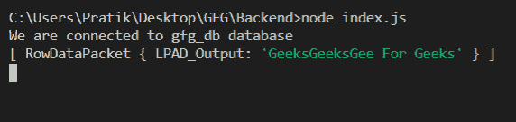
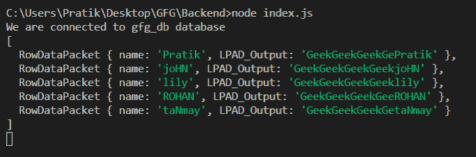

# Node.js MySQL LPAD()函数

> 原文:[https://www.geeksforgeeks.org/node-js-mysql-lpad-function/](https://www.geeksforgeeks.org/node-js-mysql-lpad-function/)

**LPAD()** 函数是 MySQL 中的一个内建函数，用于将给定的字符串从左侧附加到文本中，直到总长度等于给定值。如果给定的字符串很小，那么它会重复多次。

**语法:**

```js
LPAD(text, total_length, string)
```

**参数:** LPAD()函数接受三个参数，如上所述，如下所述。

*   **文本:**在该文本中，值将从左侧填充
*   **total_length:** 输出字符串的总长度
*   **字符串:**此字符串值将从左侧填充

**返回值:** LPAD()函数通过从左侧将值附加到文本中直到总长度等于给定值来返回字符串。如果该值很小，则重复多次。

**模块:**

*   **mysql:** 处理 mysql 连接和查询

```js
npm install mysql
```

**SQL 发布者表预览:**


**例 1:**

## java 描述语言

```js
const mysql = require("mysql");

let db_con = mysql.createConnection({
  host: "localhost",
  user: "root",
  password: "",
  database: "gfg_db",
});

db_con.connect((err) => {
  if (err) {
    console.log("Database Connection Failed !!!", err);
    return;
  }

  console.log("We are connected to gfg_db database");

  // here is the query
  let query = `SELECT LPAD(' For Geeks', 23, 'Geeks') AS LPAD_Output`;

  db_con.query(query, (err, rows) => {
    if (err) throw err;

    console.log(rows);
  });
});
```

**输出:**



**例 2:**

## java 描述语言

```js
const mysql = require("mysql");

let db_con = mysql.createConnection({
  host: "localhost",
  user: "root",
  password: "",
  database: "gfg_db",
});

db_con.connect((err) => {
  if (err) {
    console.log("Database Connection Failed !!!", err);
    return;
  }

  console.log("We are connected to gfg_db database");

  // here is the query
  let query = `SELECT name, LPAD(name, 20, 'Geek') 
               AS LPAD_Output FROM publishers`;

  db_con.query(query, (err, rows) => {
    if (err) throw err;

    console.log(rows);
  });
});
```

**输出:**

