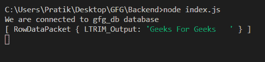
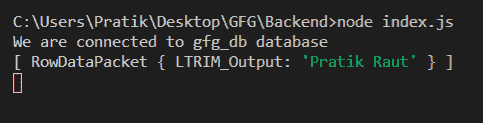

# Node.js MySQL LTRIM()函数

> 原文:[https://www.geeksforgeeks.org/node-js-mysql-ltrim-function/](https://www.geeksforgeeks.org/node-js-mysql-ltrim-function/)

**LTRIM()** 函数是 MySQL 中的一个内置函数，用于修剪输入字符串左侧的所有空格。

**语法:**

```js
LTRIM(string)
```

**参数:** LTRIM()函数接受单个参数，如上所述，如下所述。

*   **弦:**弦需要从左侧修剪

**返回值:**

函数的作用是:从左侧修剪后返回字符串。

**模块:**

*   **mysql:** 处理 mysql 连接和查询

```js
npm install mysql
```

**示例 1:** 硬编码查询

## java 描述语言

```js
const mysql = require("mysql");

let db_con = mysql.createConnection({
  host: "localhost",
  user: "root",
  password: "",
  database: "gfg_db",
});

db_con.connect((err) => {
  if (err) {
    console.log("Database Connection Failed !!!", err);
    return;
  }

  console.log("We are connected to gfg_db database");

  // here is the query
  let query = `SELECT LTRIM('   Geeks For Geeks   ') AS LTRIM_Output`;

  db_con.query(query, (err, rows) => {
    if (err) throw err;

    console.log(rows);
  });
});
```

**输出:**



**示例 2:** 动态查询

## java 描述语言

```js
const mysql = require("mysql");

let db_con = mysql.createConnection({
  host: "localhost",
  user: "root",
  password: "",
  database: "gfg_db",
});

db_con.connect((err) => {
  if (err) {
    console.log("Database Connection Failed !!!", err);
    return;
  }

  console.log("We are connected to gfg_db database");

  // notice the ? in query
  let query = `SELECT LTRIM(?) AS LTRIM_Output`;

  // Dynamic Input
  let input_string = "  Pratik Raut";

  // Notice Second Dynamic Parameter
  db_con.query(query, input_string, (err, rows) => {
    if (err) throw err;

    console.log(rows);
  });
});
```

**输出:**

