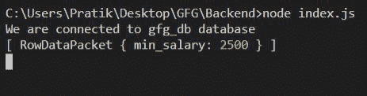
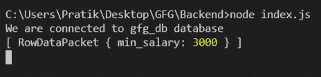

# Node.js MySQL Min()函数

> 原文:[https://www.geeksforgeeks.org/node-js-mysql-min-function/](https://www.geeksforgeeks.org/node-js-mysql-min-function/)

我们将在 MySQL 中使用 **Min()** 函数从某个特定的列中获取最小值。

**语法:**

```
MIN(column_name)
```

**参数:** MIN()函数接受一个参数，如上所述，如下所述。

*   **列名:**我们必须从中返回最小值的列名。

**返回值:** MIN()函数返回表中特定列的最小值。

**模块安装:**使用以下命令安装 MySQL 模块。

```
npm install mysql
```

**数据库:**我们的带有样本数据的 SQL 发布者表预览如下所示。


**例 1:**

## index.js

```
const mysql = require("mysql");

let db_con  = mysql.createConnection({
    host: "localhost",
    user: "root",
    password: '',
    database: 'gfg_db'
});

db_con.connect((err) => {
    if (err) {
      console.log("Database Connection Failed !!!", err);
      return;
    }

    console.log("We are connected to gfg_db database");

    // Here is the query
    let query = "SELECT MIN(salary) AS min_salary FROM publishers";

    db_con.query(query, (err, rows) => {
        if(err) throw err;

        console.log(rows);
    });
});
```

**输出:**



**例 2:**

## index.js

```
const mysql = require("mysql");

let db_con  = mysql.createConnection({
    host: "localhost",
    user: "root",
    password: '',
    database: 'gfg_db'
});

db_con.connect((err) => {
    if (err) {
      console.log("Database Connection Failed !!!", err);
      return;
    }

    console.log("We are connected to gfg_db database");

    // Here is the query
    let query = "SELECT MIN(salary) AS min_salary 
                 FROM publishers WHERE id < 7";

    db_con.query(query, (err, rows) => {
        if(err) throw err;

        console.log(rows);
    });
});
```

**输出:**

