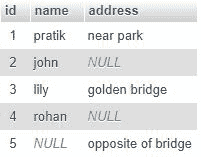
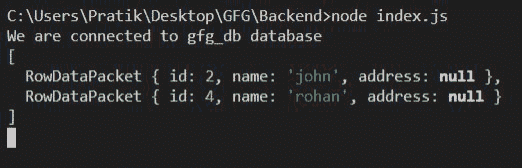

# Node.js MySQL 空值

> 原文:[https://www.geeksforgeeks.org/node-js-mysql-null-values/](https://www.geeksforgeeks.org/node-js-mysql-null-values/)

在本文中，将学习处理**空值**并在**空值**的基础上进行查询。

**语法:**

```js
IS NULL;
```

```js
IS NOT NULL;
```

**返回值:**

*   “为空”返回列中包含一个或多个空值的行。
*   “不为空”返回列中不包含任何空值的行。

**模块安装:**使用以下命令安装 MySQL 模块。

```js
npm install mysql
```

**数据库:**我们的带有样本数据的 SQL 发布者表预览如下所示。



**例 1:**

## index.js

```js
const mysql = require("mysql");

let db_con  = mysql.createConnection({
    host: "localhost",
    user: "root",
    password: '',
    database: 'gfg_db'
});

db_con.connect((err) => {
    if (err) {
      console.log("Database Connection Failed !!!", err);
      return;
    }

    console.log("We are connected to gfg_db database");

    // Here is the query
    let query = "SELECT * FROM users WHERE address IS NULL";

    db_con.query(query, (err, rows) => {
        if(err) throw err;

        console.log(rows);
    });
});
```

**输出:**



**例 2:**

## index.js

```js
const mysql = require("mysql");

let db_con  = mysql.createConnection({
    host: "localhost",
    user: "root",
    password: '',
    database: 'gfg_db'
});

db_con.connect((err) => {
    if (err) {
      console.log("Database Connection Failed !!!", err);
      return;
    }

    console.log("We are connected to gfg_db database");

    // Here is the query
    let query = "SELECT * FROM users WHERE address IS NOT NULL";

    db_con.query(query, (err, rows) => {
        if(err) throw err;

        console.log(rows);
    });
});
```

**输出:**

