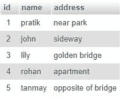
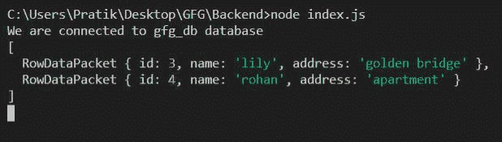
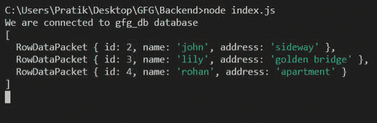

# Node.js MySQL OR 运算符

> 原文:[https://www.geeksforgeeks.org/node-js-mysql-or-operator/](https://www.geeksforgeeks.org/node-js-mysql-or-operator/)

**NodeJs:** 一个在服务器端执行 javascript 代码的开源平台。此外，一个 javascript 运行时建立在 Chrome 的 V8 JavaScript 引擎上。可以从 [<u>这里</u>](https://nodejs.org/en/) <u>下载。</u> **Mysql** 一个使用结构化查询语言(sql)的开源关系数据库管理系统(RDBMS)。它是在数据库中添加、访问和管理内容的最流行的语言。这里我们将使用 Mysql 作为节点应用程序的数据库。可以从这里的 [<u>下载。</u>](https://dev.mysql.com/downloads/mysql/5.6.html)

**或运算符**:该运算符是一个逻辑运算符，用于在任一条件为真时从表中获取记录。我们使用 OR 运算符在 MySQL 中设置一个基本的联合查询。

**语法:**

> 从[表名]中选择[列名]，其中条件 1 或条件 2 或条件 3 …

**模块:**

*   mysql: **mysql 模块**用于 mysql 服务器与 node.js 应用的交互。

**安装模块:**

```js
npm install mysql
```

**SQL 用户表预览:**



**例 1:**

**index.js**

## java 描述语言

```js
//Importing mysql module
const mysql = require("mysql");
//Creating connection
let db_con  = mysql.createConnection({
    host: "localhost",
    user: "root",
    password: '',
    database: 'gfg_db'
});

db_con.connect((err) => {
    if (err) {
      console.log("Database Connection Failed !!!", err);
      return;
    }

    console.log("We are connected to gfg_db database");

    // Query to be executed
    let query = "SELECT * FROM users WHERE id = 3 OR name = 'rohan'";

    //Executing the query
    db_con.query(query, (err, rows) => {
        if(err) throw err;

        console.log(rows);
    });
});
```

使用以下命令运行 **index.js** 文件:

```js
node index.js
```

**控制台输出:**



**例 2:**

**index.js**

## java 描述语言

```js
//Importing mysql module
const mysql = require("mysql");
//Creating connection
let db_con  = mysql.createConnection({
    host: "localhost",
    user: "root",
    password: '',
    database: 'gfg_db'
});
db_con.connect((err) => {
    if (err) {
      console.log("Database Connection Failed !!!", err);
      return;
    }

    console.log("We are connected to gfg_db database");

    // Query to be executed
    let query = "SELECT * FROM users WHERE id = 3 OR name = 'rohan' OR address = 'sideway'";
    // Executing query
    db_con.query(query, (err, rows) => {
        if(err) throw err;

        console.log(rows);
    });
});
```

使用以下命令运行 **index.js** 文件:

```js
node index.js
```

**控制台输出:**

