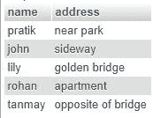
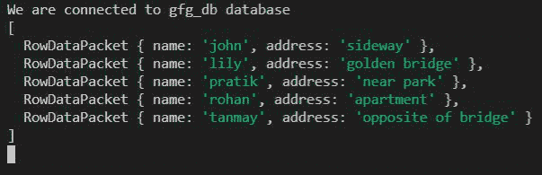
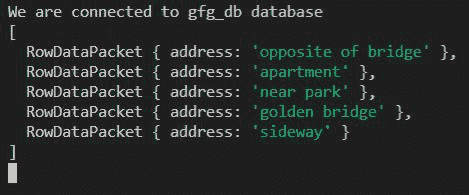

# 节点. js MySQL Order By 子句

> 原文:[https://www . geesforgeks . org/node-js-MySQL-order-by 子句/](https://www.geeksforgeeks.org/node-js-mysql-order-by-clause/)

**简介:**我们使用 SQL ORDER BY 子句按照升序或降序对某个列值的数据进行排序。

**语法:**

> **从用户中选择*按名称排序；**
> 这将按照名称列的升序(默认)对所有输出行进行排序。
> 
> **从用户中选择地址，按姓名 DESC 排序；**
> 这将按照名称列降序对所有输出行进行排序，但返回地址数据。

**模块安装:**使用以下命令安装 **mysql** 模块:

```
npm install mysql
```

**数据库:**我们的 SQL ***用户*** 表预览用样本数据如下所示:



**示例 1:** 从用户表中选择所有列，但按名称升序排序。

## index.js

```
const mysql = require("mysql");

let db_con  = mysql.createConnection({
    host: "localhost",
    user: "root",
    password: '',
    database: 'gfg_db'
});

db_con.connect((err) => {
    if (err) {
      console.log("Database Connection Failed !!!", err);
      return;
    }

    console.log("We are connected to gfg_db database");

    // Our Query
    let query = 'SELECT * FROM users ORDER BY name';

    db_con.query(query, (err, rows) => {
        if(err) throw err;

        console.log(rows);
    });
});
```

使用以下命令运行 **index.js** 文件:

```
node index.js
```

**输出:**



**示例 2:** 仅从用户表中选择地址列，但按名称降序排列。

## index.js

```
const mysql = require("mysql");

let db_con  = mysql.createConnection({
    host: "localhost",
    user: "root",
    password: '',
    database: 'gfg_db'
});

db_con.connect((err) => {
    if (err) {
      console.log("Database Connection Failed !!!", err);
      return;
    }

    console.log("We are connected to gfg_db database");

    // Notice the address column and DESC below
    let query = 'SELECT address FROM users ORDER BY name DESC';

    db_con.query(query, (err, rows) => {
        if(err) throw err;

        console.log(rows);
    });
});
```

使用以下命令运行 **index.js** 文件:

```
node index.js
```

**输出:**

