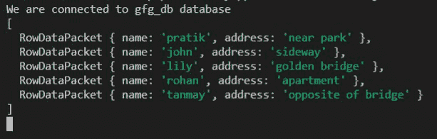
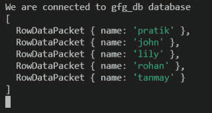

# 节点. js MySQL 从表中选择

> 原文:[https://www . geesforgeks . org/node-js-MySQL-select-from-table/](https://www.geeksforgeeks.org/node-js-mysql-select-from-table/)

**简介:**了解使用 node.js 从 MySQL 数据库中选择数据，我们将使用标准的 SELECT FROM SQL 查询。

**语法:**

```js
SELECT [column] FROM [table_name]
```

**示例:**

```js
1) SELECT * FROM customers
selecting all columns from customers table.

2) SELECT name, address FROM customers
```

**SQL 用户表预览:**


**示例 1:** 从用户表中选择所有列

## index.js

```js
const mysql = require("mysql");

let db_con  = mysql.createConnection({
    host: "localhost",
    user: "root",
    password: '',
    database: 'gfg_db'
});

db_con.connect((err) => {
    if (err) {
      console.log("Database Connection Failed !!!", err);
      return;
    }

    console.log("We are connected to gfg_db database");

    // This query will be used to select columns
    let query = 'SELECT * FROM users';

    db_con.query(query, (err, rows) => {
        if(err) throw err;

        console.log(rows);
    });
});
```

**输出:**



**示例 2:** 从用户表中选择*名称*列

## index.js

```js
const mysql = require("mysql");

let db_con  = mysql.createConnection({
    host: "localhost",
    user: "root",
    password: '',
    database: 'gfg_db'
});

db_con.connect((err) => {
    if (err) {
      console.log("Database Connection Failed !!!", err);
      return;
    }

    console.log("We are connected to gfg_db database");

    // notice the name column below
    let query = 'SELECT name FROM users';

    db_con.query(query, (err, rows) => {
        if(err) throw err;

        console.log(rows);
    });
});
```

**输出:**

