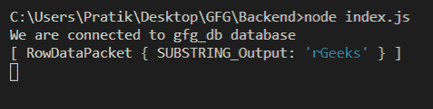
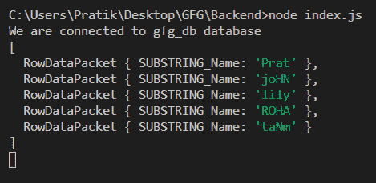

# Node.js MySQL SUBSTRING()函数

> 原文:[https://www . geesforgeks . org/node-js-MySQL-substring-function/](https://www.geeksforgeeks.org/node-js-mysql-substring-function/)

**SUBSTRING()** 函数是 MySQL 中的内置函数，用于获取给定范围(含)之间的输入字符串的子字符串。

**语法:**

```js
SUBSTRING(input_string, from, length)
```

**参数:**取三个参数如下:

*   **input_string** :是执行子串的给定字符串。
*   **从**开始:从这个位置开始取子串。
*   **长度**:是子串的长度。

**返回值:**返回给定起始位置和长度之间的输入字符串的子串。如果长度超出字符串，则忽略多余的部分。

**模块安装:**使用以下命令安装 **mysql** 模块:

```js
npm install mysql
```

**数据库:**我们的 SQL **发布者** 带有样本数据的表格预览如下所示:


**例 1:**

## index.js

```js
const mysql = require("mysql");

let db_con  = mysql.createConnection({
    host: "localhost",
    user: "root",
    password: '',
    database: 'gfg_db'
});

db_con.connect((err) => {
    if (err) {
      console.log("Database Connection Failed !!!", err);
      return;
    }

    console.log("We are connected to gfg_db database");

    // Notice the ? in query
    let query = `SELECT SUBSTRING("GeeksforGeeks", 
                 8, 20) AS SUBSTRING_Output`;

    db_con.query(query, (err, rows) => {
        if(err) throw err;

        console.log(rows);
    });
});
```

使用以下命令运行 **index.js** 文件:

```js
node index.js
```

**输出:**



**例 2:**

## index.js

```js
const mysql = require("mysql");

let db_con  = mysql.createConnection({
    host: "localhost",
    user: "root",
    password: '',
    database: 'gfg_db'
});

db_con.connect((err) => {
    if (err) {
      console.log("Database Connection Failed !!!", err);
      return;
    }

    console.log("We are connected to gfg_db database");

    // Notice the ? in query
    let query = `SELECT SUBSTRING(name, 1, 4) 
            AS SUBSTRING_Name FROM publishers`;

    db_con.query(query, (err, rows) => {
        if(err) throw err;

        console.log(rows);
    });
});
```

使用以下命令运行 **index.js** 文件:

```js
node index.js
```

**输出:**

