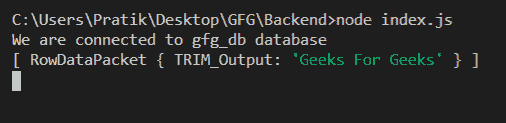
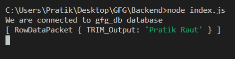

# Node.js MySQL TRIM()函数

> 原文:[https://www.geeksforgeeks.org/node-js-mysql-trim-function/](https://www.geeksforgeeks.org/node-js-mysql-trim-function/)

**TRIM()** 函数是 MySQL 中的内置函数，用于修剪输入字符串两侧的所有空格。

**语法:**

```
TRIM(string)
```

**参数:**取一个参数如下:

*   **弦**:是要从两边修剪的弦。

**返回值:**从两侧修剪后返回字符串。

**模块安装:**使用以下命令安装 **mysql** 模块:

```
npm install mysql
```

**示例 1:** 硬编码查询

## index.js

```
const mysql = require("mysql");

let db_con  = mysql.createConnection({
    host: "localhost",
    user: "root",
    password: '',
    database: 'gfg_db'
});

db_con.connect((err) => {
    if (err) {
      console.log("Database Connection Failed !!!", err);
      return;
    }

    console.log("We are connected to gfg_db database");

    // Here is the query
    let query = 
`SELECT TRIM('   Geeks For Geeks   ') AS TRIM_Output`;

    db_con.query(query, (err, rows) => {
        if(err) throw err;

        console.log(rows);
    });
});
```

使用以下命令运行 **index.js** 文件:

```
node index.js
```

**输出:**



**示例 2:** 动态查询

## index.js

```
const mysql = require("mysql");

let db_con  = mysql.createConnection({
    host: "localhost",
    user: "root",
    password: '',
    database: 'gfg_db'
});

db_con.connect((err) => {
    if (err) {
      console.log("Database Connection Failed !!!", err);
      return;
    }

    console.log("We are connected to gfg_db database");

    // Notice the ? in query
    let query = `SELECT TRIM(?) AS TRIM_Output`;

    // Dynamic Input
    let input_string = "    Pratik Raut   ";

    // Notice Second Dynamic Parameter
    db_con.query(query, input_string, (err, rows) => {
        if(err) throw err;

        console.log(rows);
    });
});
```

使用以下命令运行 **index.js** 文件:

```
node index.js
```

**输出:**

