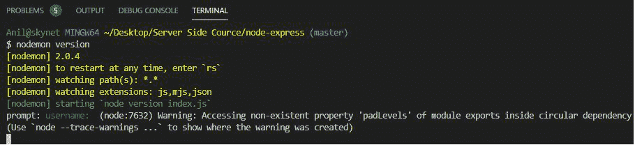
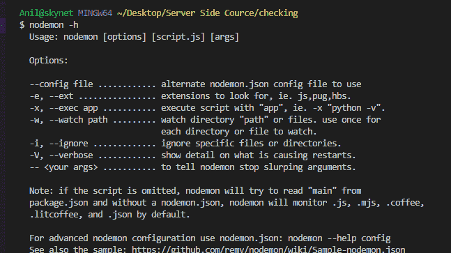
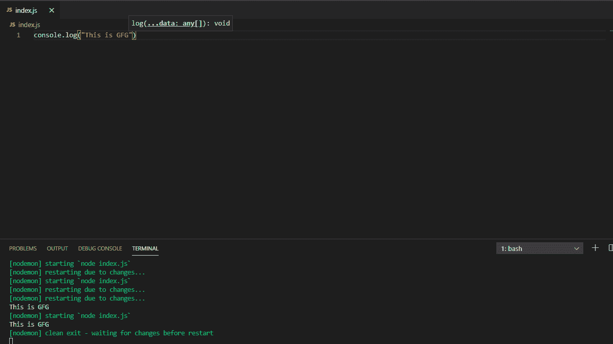

# Node.js nodemon 模块

> 原文:[https://www.geeksforgeeks.org/node-js-nodemon-module/](https://www.geeksforgeeks.org/node-js-nodemon-module/)

nodemon Module 是一个开发基于 node.js 的应用程序的模块，它在检测到目录中的文件更改时自动重新启动节点应用程序。Nodemon 不需要对原始代码和开发方法进行任何更改。

**使用 nodemon 模块的优势:**

1.  它很容易使用，也很容易上手。
2.  它不影响原始代码，并且没有实例需要调用它。
3.  有助于减少反复输入默认语法节点<file name="">执行的时间。</file>

**安装:**使用以下命令安装模块:

```js
npm install -g nodemon
```

安装模块后，您可以通过在控制台上键入以下内容来检查模块的当前版本:

```js
nodemon version
```



用法:

1.  nodemon 包装了您的应用程序，因此您可以将通常传递给应用程序的所有参数传递给应用程序:

    ```js
    nodemon [your node app]

    ```

2.  Options available for nodemon are shown below:

    ```js
    nodemon -h

    ```

    

**运行程序的步骤:**使用以下命令运行文件，如下所示:

```js
nodemon index.js
```



它会在编写新语句时自动检查语句和程序的语法，并将结果显示在控制台上。