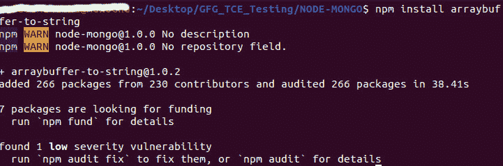
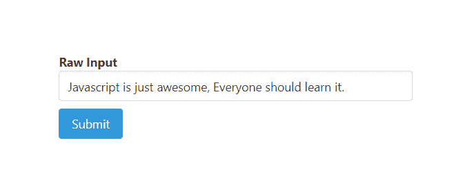
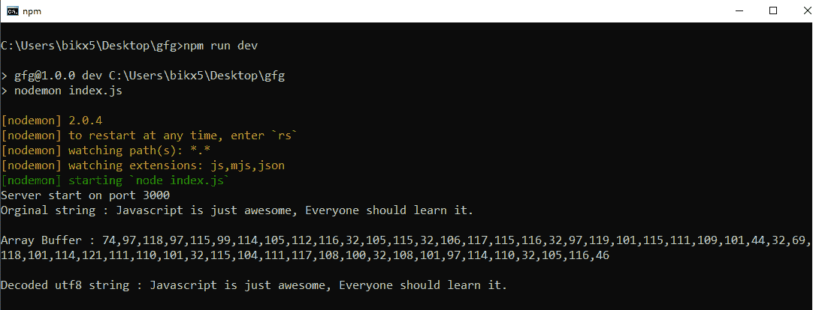
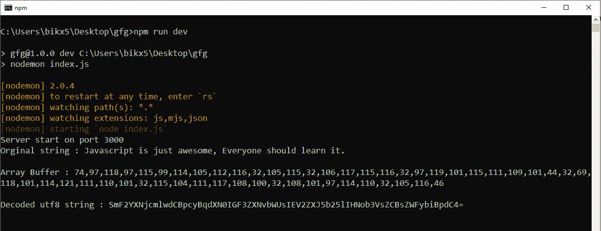

# 节点. js NPM 数组填充到字符串模块

> 原文:[https://www . geesforgeks . org/node-js-NPM-arraybuffer-to-string-module/](https://www.geeksforgeeks.org/node-js-npm-arraybuffer-to-string-module/)

NPM(节点包管理器)是 Node.js 包的包管理器。有一个名为 arraybuffer to string 的 NPM 包，用于解码实际字符串中的数组缓冲区。该包不仅将缓冲区转换为“utf8”字符串，还将缓冲区转换为许多形式，如 base64 编码字符串，这是我们在许多上下文中使用的十六进制编码字符串。

**安装命令:**

```
npm install arraybuffer-to-string
```



**在本地文件**中导入包的语法

```
const arrayBufferToString = require('arraybuffer-to-string')
```

**将数组填充符转换为字符串的语法**

```
arrayBufferToString(buffer, encodingType)
```

**参数:**需要两个参数“buffer”和“encodingType”，我们要将 arraybuffer 转换为这两个参数，如下所示:

*   **缓冲区:**是我们要转换为实际文本的数组缓冲区。node.js 中有很多方法不直接返回字符串的实际内容，而是返回响应的缓冲形式。在这些上下文中，我们使用这个包将缓冲区转换为字符串。
*   **编码类型:**为可选参数，默认值为‘utf8’。它表示我们要将缓冲区转换成的字符串的类型。可用的编码有 utf8、二进制、base64、十六进制、ascii、latin1、ucs2、utf16 和许多其他编码。

**示例 1:** 这个示例说明了如何使用‘arraybuffer-to string’从数组缓冲区转换为 utf8 字符串。

**Filename–index . js:**该文件包含将 arraybuffer 转换为 utf8 字符串的逻辑。

## java 描述语言

```
const express = require('express')
const bodyParser = require('body-parser')
const arrayBufferToString =require('arraybuffer-to-string')
const formTemplet = require('./form')

const app = express()
const port = process.env.PORT || 3000

// The body-parser middleware to parse form data
app.use(bodyParser.urlencoded({extended : true}))

// Get route to display HTML form
app.get('/', (req, res) => {
  res.send(formTemplet({}))
})

// Post route to handle form submission logic and
app.post('/', (req, res) => {
  const {rawInput} = req.body
  // Creating buffer of string
  const buffer = Buffer.from(rawInput)

  // Buffer to array buffer
  var uint8 = new Uint8Array(buffer)

  // Converting from array buffer to actual utf8 string
  const utf8str = arrayBufferToString(uint8)

  // Printing on console
  console.log(`Original string : ${rawInput}\n`)
  console.log(`Array Buffer : ${uint8}\n`)
  console.log(`Decoded utf8 string : ${utf8str}\n`)
})

// Server setup
app.listen(port, () => {
  console.log(`Server start on port ${port}`)
})
```

**filename-form.js:** 该文件包含渲染表单的逻辑。

## java 描述语言

```
module.exports = ({errors}) => {
  return `
<!DOCTYPE html>
<html>

<head>
  <link rel='stylesheet' href=
'https://cdnjs.cloudflare.com/ajax/libs/bulma/0.9.0/css/bulma.min.css'>
  <style>
    div.columns {
      margin-top: 100px;
    }

    .button {
      margin-top: 10px
    }
  </style>
</head>

<body>
  <div class='container'>
    <div class='columns is-centered'>
      <div class='column is-5'>
        <form action='/' method='POST'>
          <div>
            <div>
              <label class='label'
                id='raw-input'>Raw Input
              </label>
            </div>
            <input class='input' type='text'
              name='rawInput' placeholder=
              'Raw Input' for='raw-input'>
          </div>
          <div>
            <button class='button is-info'>
              Submit
            </button>
          </div>
        </form>
      </div>
    </div>
  </div>
</body>

</html>
  `
}
```

**输出:**



提交输入字符串，将其从字符串转换为数组缓冲区，再转换为 utf8 编码的字符串



在命令提示符下打印的响应

**示例 2:** 此示例说明如何使用“arraybuffer-to string”从数组缓冲区转换为 base64 编码字符串。

**Filename–index . js:**该文件包含将 arraybuffer 转换为 base64 编码字符串的逻辑。

## java 描述语言

```
const express = require('express')
const bodyParser = require('body-parser')
const arrayBufferToString =require('arraybuffer-to-string')
const formTemplet = require('./form')

const app = express()
const port = process.env.PORT || 3000

// The body-parser middleware to parse form data
app.use(bodyParser.urlencoded({extended : true}))

// Get route to display HTML form
app.get('/', (req, res) => {
  res.send(formTemplet({}))
})

// Post route to handle form submission logic and
app.post('/', (req, res) => {
  const {rawInput} = req.body
  // Creating buffer of string
  const buffer = Buffer.from(rawInput)

  // Buffer to array buffer
  var uint8 = new Uint8Array(buffer)

  // Converting from array buffer to actual
  // base64 encoded string
  const base64str = arrayBufferToString(uint8, 'base64')

  // Printing on console
  console.log(`Original string : ${rawInput}\n`)
  console.log(`Array Buffer : ${uint8}\n`)
  console.log(`Decoded utf8 string : ${base64str}\n`)
})

// Server setup
app.listen(port, () => {
  console.log(`Server start on port ${port}`)
})
```

**filename-form.js :** 该文件包含渲染表单的逻辑。

## java 描述语言

```
module.exports = ({errors}) => {
  return `
<!DOCTYPE html>
<html>

<head>
  <link rel='stylesheet' href=
'https://cdnjs.cloudflare.com/ajax/libs/bulma/0.9.0/css/bulma.min.css'>
  <style>
    div.columns {
      margin-top: 100px;
    }

    .button {
      margin-top: 10px
    }
  </style>
</head>

<body>
  <div class='container'>
    <div class='columns is-centered'>
      <div class='column is-5'>
        <form action='/' method='POST'>
          <div>
            <div>
              <label class='label' id=
                'raw-input'>Raw Input
              </label>
            </div>
            <input class='input' type='text'
              name='rawInput' placeholder=
              'Raw Input' for='raw-input'>
          </div>
          <div>
            <button class='button is-info'>
              Submit
            </button>
          </div>
        </form>
      </div>
    </div>
  </div>
</body>

</html>
  `
}
```

**输出:**


提交输入字符串，将其从字符串转换为数组缓冲区，再转换为 base64 编码的字符串



在命令提示符下打印的响应

**注意:**我们在 form.js 文件中使用了一些布尔玛类来设计内容。