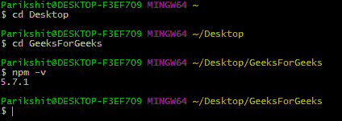
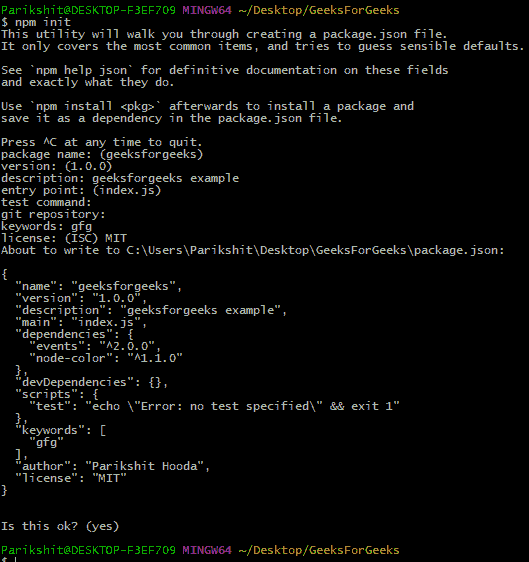
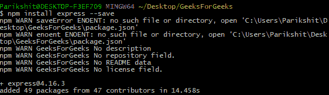
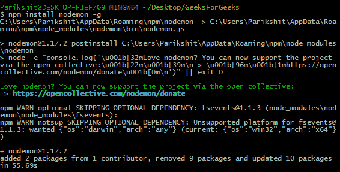
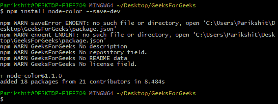
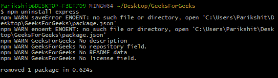

# Node.js | NPM(节点包管理器)

> 原文:[https://www . geesforgeks . org/node-js-NPM-node-package-manager/](https://www.geeksforgeeks.org/node-js-npm-node-package-manager/)

**NPM(节点包管理器)**是 Node.js 的默认包管理器，完全用 [Javascript](https://www.geeksforgeeks.org/javascript-tutorial/) 编写。由艾萨克·施吕特开发，最初于 2010 年 1 月 12 日发布。NPM 管理 Node.js 的所有包和模块，并由命令行客户端 **npm** 组成。它通过安装 Node.js 安装到系统中。Node 项目中所需的包和模块是使用 NPM 安装的。
一个包包含一个模块需要的所有文件，模块是可以根据项目的需求包含在 Node 项目中的 JavaScript 库。
NPM 可以通过 [package.json](https://www.geeksforgeeks.org/node-js-package-json/) 文件安装一个项目的所有依赖项。它还可以更新和卸载软件包。在 [package.json](https://www.geeksforgeeks.org/node-js-package-json/) 文件中，每个依赖项都可以使用语义版本方案指定一个有效版本的范围，允许开发人员自动更新他们的包，同时避免不必要的破坏性更改。

**关于 NPM 的一些事实:**

*   在撰写本文时，NPM 已有 580096 个注册包。这个数字的平均增长率为 291/天，超过了其他所有包注册表。
*   npm 是开源的
*   按降序排列的顶级 npm 包是:lodash、async、react、request、express。

**安装 NPM:**
要安装 NPM，需要在 NPM 自动安装 Node.js 的同时安装 Node.js。
[安装 Node.js](https://nodejs.org/en/) 。

**检查和更新 npm 版本:**
安装在系统上的 **npm** 版本可以使用以下语法进行检查:
**语法:**

```
npm -v

```



检查 npm 版本

如果安装的版本不是最新的，可以使用给定的语法更新它:
**语法:**

```
npm npm@latest -g.

```

由于 **npm** 是全局包， **-g** 标志用于全局更新**。**

****创建节点项目:**
要创建节点项目，在用户要创建项目的文件夹中使用 **npm init** 。npm 命令行会问很多问题，如**名称、许可证、脚本、描述、作者、关键词、版本、主文件**等。npm 创建完项目后，项目文件夹中会出现一个 [package.json](https://www.geeksforgeeks.org/node-js-package-json/) 文件，作为项目已经初始化的证明。** 

**

npm 初始化** 

****安装包:**
创建项目后，下一步是合并要在节点项目中使用的包和模块。要在项目中安装软件包和模块，请使用以下语法:
**语法:****

```
**npm install package_name** 
```

****示例:**将快递包裹安装到项目中。Express 是节点使用的网络开发框架。
**语法:****

```
**npm install express**
```

**要在节点中使用 express，请遵循以下语法:
**语法:****

```
var express = require('express'); 
```

**

安装快速模块** 

****示例:**要全局安装一个包(系统中的所有项目都可以访问)，请在用于安装该包的语法中添加一个额外的 **-g** 标记。
全球安装 **nodemon** 套装。**

```
**npm install nodemon -g**
```

**

全局安装 nodemon 包** 

****控制包的安装位置:**
要安装包并同时将其保存在 [package.json](https://www.geeksforgeeks.org/node-js-package-json/) 文件中(如果使用 Node.js)，请添加**–save**标志。**–保存**标志在 npm 安装命令中是默认的，因此它等于 **npm 安装包名称**命令。
**示例:****

```
**npm install express --save**
```

**通过**–保存**标志，可以控制软件包的安装位置。
**–保存生产:**使用该软件包将出现在依赖项中，这也是默认情况。
**–save-dev:**使用这个包将会出现在 devDependencies 中，并且只会在开发模式下使用。
**示例:** npm 安装节点-颜色-保存-开发** 

**

–保存-开发示例** 

**如果有一个 [package.json](https://www.geeksforgeeks.org/node-js-package-json/) 文件，其中已经提到了所有的包作为依赖项，只需在终端中键入 **npm install** 。 **npm** 将查看 package.json 文件，并根据它们提到的版本安装所有的依赖项。此命令通常在分叉和克隆节点项目时使用。作为一个大文件夹的 **node_modules** 通常不会被推送到 github repo，克隆程序必须运行 **npm install** 来安装依赖项。**

****注意:** NPM 以本地模式(默认)安装依赖项，该依赖项转到存在于节点应用程序文件夹中的**节点模块**目录。要查看所有本地安装的模块，请使用 **npm ls** 命令。**

****卸载软件包:**
要使用 npm 卸载软件包，请遵循以下语法:
**语法:****

```
**npm uninstall** 
```

****示例:**卸载快递包裹** 

**

卸载 express** 

**要卸载全局软件包，请遵循以下语法:
**语法:****

```
**npm uninstall package_name -g**
```

****使用语义版本管理包:**
**

*   **要安装特定版本的软件包，请在 [package.json](https://www.geeksforgeeks.org/node-js-package-json/) 文件中提及完整准确的版本。**
*   **要安装最新版本的软件包，请在依赖项或“最新”前面加上“*”。这将找到模块的最新稳定版本并安装它。**
*   **要在给定版本之上安装任何版本(稳定版本)，请在下面的示例中提到它:
    **“express":"^4.1.1″.**在[包](https://www.geeksforgeeks.org/node-js-package-json/)文件中。插入符号(^)用于告诉 npm 找到一个大于 4.1.1 的版本并安装它。**