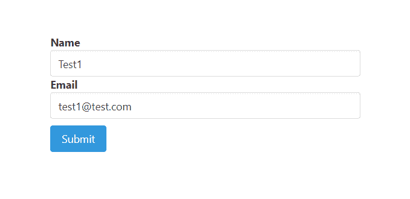
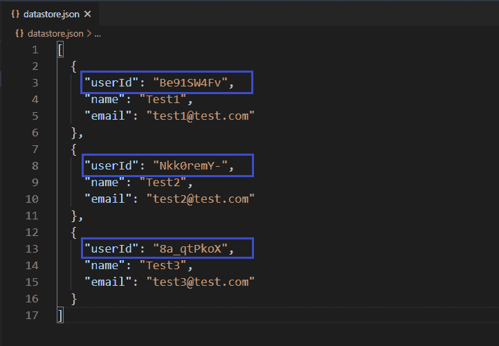
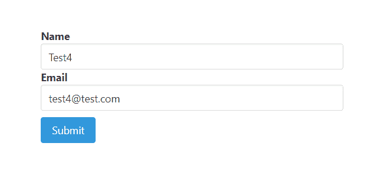
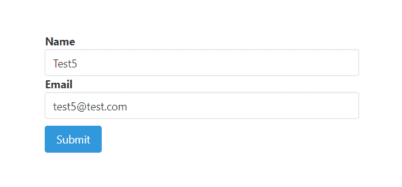
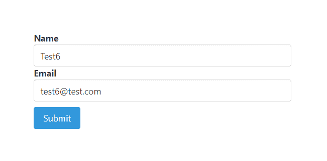
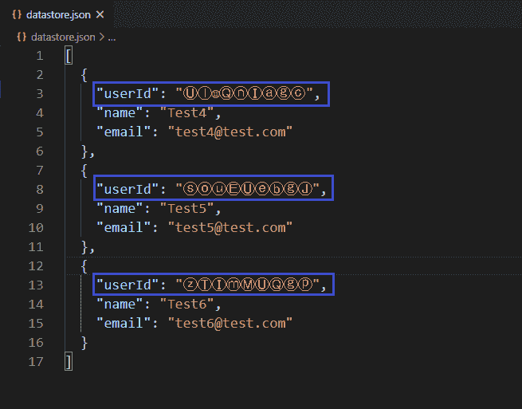

# 节点 NPM 短标识模块

> 原文:[https://www.geeksforgeeks.org/node-js-npm-shortid-module/](https://www.geeksforgeeks.org/node-js-npm-shortid-module/)

NPM(节点包管理器)是 Node.js 包的包管理器。有一个名为**‘short id’**的 NPM 包，用于创建简短的非顺序 url 友好的唯一 id。默认情况下，它使用 7-14 个 url 友好字符:a-z、A-Z、0-9、_-。它支持集群(自动)，自定义种子，自定义字母表。它可以生成任意数量的身份证没有重复。

**安装命令:**

```js
npm install shortid
```

**在本地文件中导入包的语法-**

```js
const shortid = require('shortid')
```

**创建唯一 id 的语法-**

```js
const newId = shortid.generate()
```

shortid 模块上定义了一些方法来创建唯一的 id 和自定义 id。下面举例说明了一些方法。

**short id . generate()–**用于创建唯一 id。

**示例:**

```js
users.insert({
  _id: shortid.generate(),
  name: '...',
  email: '...'
});
```

**short id . is valid(id)–**用于检查 id 是否有效。

**示例:**

```js
shortid.isValid('41GHDbE');
// true
shortid.isValid('i have spaces');
// false
```

**shortid.characters(字符)–**用于自定义 id。

**示例:**

```js
shortid.characters('ⒶⒷⒸⒹⒺⒻⒼⒽⒾⒿⓀⓁⓂⓃⓄⓅⓆⓇⓈⓉ'
+ 'ⓊⓋⓌⓍⓎⓏⓐⓑⓒⓓⓔⓕⓖⓗⓘⓙⓚⓛⓜⓝⓞⓟⓠⓡⓢⓣⓤⓥ'
+ 'ⓦⓧⓨⓩ①②③④⑤⑥⑦⑧⑨⑩⑪⑫');
```

**示例 1:** 这个示例说明了如何生成和使用 shortid 包来创建唯一的 id。

**filename-index.js :** 这个文件包含创建短 id 的所有逻辑，并将其与用户信息一起附加并保存到数据库中。

```js
const express = require('express')
const bodyParser = require('body-parser')
const shortid = require('shortid')
const formTemplet = require('./form')
const repo = require('./repository')

const app = express()
const port = process.env.PORT || 3000

// The body-parser middleware to parse form data
app.use(bodyParser.urlencoded({extended : true}))

// Get route to display HTML form
app.get('/', (req, res) => {
  res.send(formTemplet({}))
})

// Post route to handle form submission logic and 
app.post('/', (req, res) => {

  // Fetching user inputs
  const {name, email} = req.body

  // Creating new unique id
  const userId = shortid.generate()

  // Saving record to the database
  // with attaching userid to each record
  repo.create({
    userId,
    name,
    email
  }) 
  res.send('Information submitted!')
})

// Server setup
app.listen(port, () => {
  console.log(`Server start on port ${port}`)
})
```

**filename–repository . js:**该文件包含创建数据库和与之交互的所有逻辑。

```js
// Importing node.js file system module 
const fs = require('fs')

class Repository {

  constructor(filename) {

    // Filename where data are going to store
    if(!filename) {
      throw new Error(
'Filename is required to create a datastore!')
    }

    this.filename = filename

    try {
      fs.accessSync(this.filename)
    } catch(err) {

      // If file not exist it is created
      // with empty array
      fs.writeFileSync(this.filename, '[]')
    }
  }

  // Get all existing records
  async getAll(){
    return JSON.parse(
      await fs.promises.readFile(this.filename, {
        encoding : 'utf8'
      })
    )
  }

  // Create new record
  async create(attrs){

    // Fetch all existing records
    const records = await this.getAll()

    // All the existing records with new
    // record push back to database
    records.push(attrs)
    await fs.promises.writeFile(
      this.filename,
      JSON.stringify(records, null, 2)   
    )
    return attrs
  }
}

// The 'datastore.json' file created
// at runtime and all the information
// provided via signup form store in
// this file in JSON format.
module.exports = 
    new Repository('datastore.json')
```

**filename–form . js:**这个文件包含了渲染表单的所有逻辑。

```js
module.exports = ({errors}) => {
  return `
<!DOCTYPE html>
<html>

<head>
  <link rel='stylesheet' href=
'https://cdnjs.cloudflare.com/ajax/libs/bulma/0.9.0/css/bulma.min.css'>
  <style>
    div.columns {
      margin-top: 100px;
    }

    .button {
      margin-top: 10px
    }
  </style>
</head>

<body>
  <div class='container'>
    <div class='columns is-centered'>
      <div class='column is-5'>
        <form action='/' method='POST'>
          <div>
            <div>
              <label class='label' id='str'>
                Name
              </label>
            </div>
            <input class='input' type='text' 
              name='name' placeholder='Name' 
              for='name'>
          </div>
          <div>
            <div>
              <label class='label' id='email'>
                Email
              </label>
            </div>
            <input class='input' type='email' 
              name='email' placeholder='Email' 
              for='email'>
          </div>
          <div>
            <button class='button is-info'>
              Submit
            </button>
          </div>
        </form>
      </div>
    </div>
  </div>
</body>

</html>
  `
}
```

**输出:**



提交信息 1


提交信息 2


提交信息 3

**数据库:**



提交信息后的数据库

**示例 2:** 此示例说明了如何自定义和使用 shortid 包来创建唯一的 id。

**filename-index.js:** 这个文件包含创建短 id 的所有逻辑，并将其与用户信息一起附加并保存到数据库中。

```js
const express = require('express')
const bodyParser = require('body-parser')
const shortid = require('shortid')
const formTemplet = require('./form')
const repo = require('./repository')

const app = express()
const port = process.env.PORT || 3000

// The body-parser middleware to parse form data
app.use(bodyParser.urlencoded({extended : true}))

// Get route to display HTML form
app.get('/', (req, res) => {
  res.send(formTemplet({}))
})

// Post route to handle form 
// submission logic and 
app.post('/', (req, res) => {

  // Fetching user inputs
  const {name, email} = req.body

  // Customising id creation
  shortid.characters('ⒶⒷⒸⒹⒺⒻⒼⒽⒾ' 
    + 'ⒿⓀⓁⓜⓃⓄⓅⓆⓇⓈⓉⓊⓋⓌⓍⓎⓏ'
    + 'ⓐⓑⓒⓓⓔⓕⓖⓗⓘⓙⓚⓛⓜⓝⓞⓟⓠ'
    + 'ⓡⓢⓣⓤⓥⓦⓧⓨⓩ①②③④⑤⑥⑦⑧⑨⑩⑪⑫')

  // Creating new unique id
  const userId = shortid.generate()

  // Saving record to the database
  // with attaching userid to each record
  repo.create({
    userId,
    name,
    email
  }) 
  res.send('Information submitted!')
})

// Server setup
app.listen(port, () => {
  console.log(`Server start on port ${port}`)
})
```

**filename–repository . js:**该文件包含创建数据库和与之交互的所有逻辑。

```js
// Importing node.js file system module 
const fs = require('fs')

class Repository {
  constructor(filename) {

    // Filename where data are going to store
    if(!filename) {
      throw new Error(
'Filename is required to create a datastore!')
    }
    this.filename = filename
    try {
      fs.accessSync(this.filename)
    } catch(err) {

      // If file not exist it is 
      // created with empty array
      fs.writeFileSync(this.filename, '[]')
    }
  }

  // Get all existing records
  async getAll(){
    return JSON.parse(
      await fs.promises.readFile(this.filename, {
        encoding : 'utf8'
      })
    )
  }

  // Create new record
  async create(attrs){
    // Fetch all existing records
    const records = await this.getAll()

    // All the existing records with new
    // record push back to database
    records.push(attrs)
    await fs.promises.writeFile(
      this.filename,
      JSON.stringify(records, null, 2)   
    )
    return attrs
  }
}

// The 'datastore.json' file created
// at runtime and all the information
// provided via signup form store in
// this file in JSON formet.
module.exports = 
    new Repository('datastore.json')
```

**文件名–form . js:**这个文件包含了渲染表单的所有逻辑

```js
const getError = (errors, prop) => {
  try {
    return errors.mapped()[prop].msg
  } catch (error) {
    return ''
  } 
}

module.exports = ({errors}) => {
  return `
<!DOCTYPE html>
<html>

<head>
  <link rel='stylesheet' href=
'https://cdnjs.cloudflare.com/ajax/libs/bulma/0.9.0/css/bulma.min.css'>
  <style>
    div.columns {
      margin-top: 100px;
    }

    .button {
      margin-top: 10px
    }
  </style>
</head>

<body>
  <div class='container'>
    <div class='columns is-centered'>
      <div class='column is-5'>
        <form action='/' method='POST'>
          <div>
            <div>
              <label class='label' id='str'>
                Name
              </label>
            </div>
            <input class='input' type='text' 
              name='name' placeholder='Name' 
              for='name'>
          </div>
          <div>
            <div>
              <label class='label' id='email'>
                Email
              </label>
            </div>
            <input class='input' type='email' 
              name='email' placeholder='Email' 
              for='email'>
          </div>
          <div>
            <button class='button is-info'>
              Submit
            </button>
          </div>
        </form>
      </div>
    </div>
  </div>
</body>

</html>  
  `
}
```

**输出:**



提交信息 1



提交信息 2



提交信息 3

**数据库:**



提交信息后的数据库

**注意:**我们在 form.js 文件中使用了一些布尔玛类来设计我们的内容。