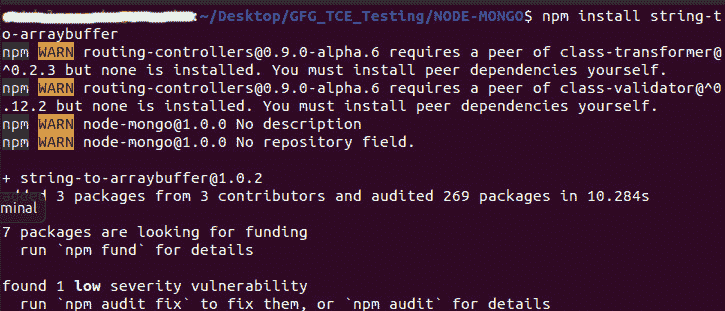
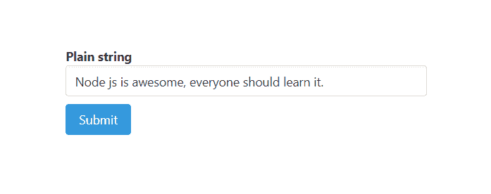
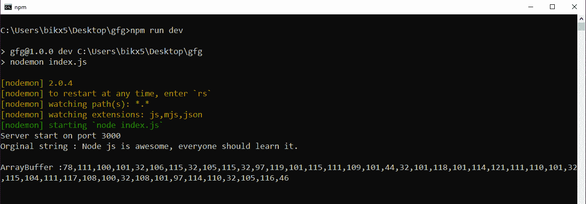
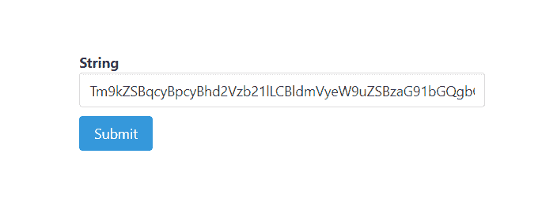
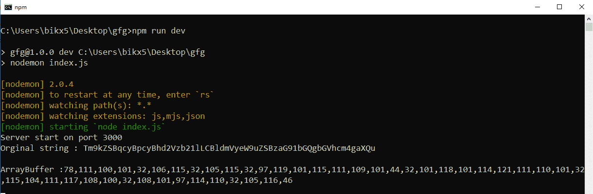
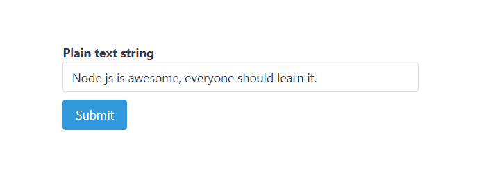
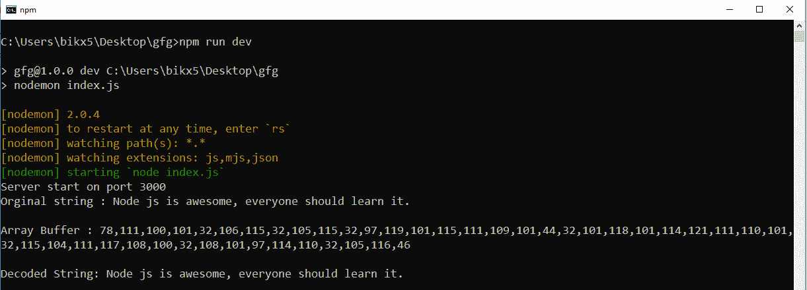
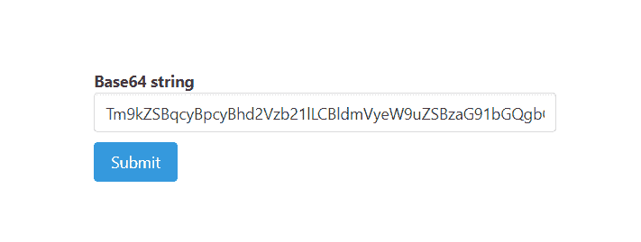
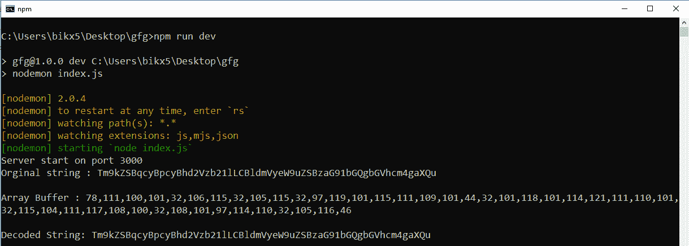

# Node.js NPM 字符串到数组填充模块

> 原文:[https://www . geesforgeks . org/node-js-NPM-string-to-arraybuffer-module/](https://www.geeksforgeeks.org/node-js-npm-string-to-arraybuffer-module/)

NPM(节点包管理器)是 Node.js 包的包管理器。有一个名为**‘short id’**的 NPM 包，用于短接非顺序的 url 友好的唯一 id。

**安装命令:**

```
npm install string-to-arraybuffer
```

**在本地文件**中导入包的语法

```
const str2ab = require('string-to-arraybuffer')
```



**将字符串转换为** **数组缓冲区**的语法

```
const arrBuff = str2Ab(string)
```

**参数:**取数组缓冲区中我们要转换的一个参数‘字符串’。

**示例 1:** 这个示例说明了如何使用‘字符串到数组缓冲区’从字符串转换到数组缓冲区。

**文件名–index . js:**该文件包含将字符串转换为数组缓冲区的逻辑。

## java 描述语言

```
const express = require('express')
const bodyParser = require('body-parser')
const str2Ab =require('string-to-arraybuffer')
const formTemplet = require('./form')

const app = express()
const port = process.env.PORT || 3000

// The body-parser middleware to parse form data
app.use(bodyParser.urlencoded({extended : true}))

// Get route to display HTML form
app.get('/', (req, res) => {
  res.send(formTemplet({}))
})

// Post route to handle form submission logic and
app.post('/', (req, res) => {
  const {str} = req.body

  // Converting from utf8 string to array buffer
  const arrBuffer = str2Ab(str)

  // Create view of array buffer
  const view = new Int8Array(arrBuffer)

  // Printing on console
  console.log(`Original string : ${str}\n`)
  console.log('ArrayBuffer :' + view)
})

// Server setup
app.listen(port, () => {
  console.log(`Server start on port ${port}`)
})
```

**Filename-form.js :** 该文件包含渲染表单的逻辑。

## java 描述语言

```
module.exports = ({errors}) => {
  return `
<!DOCTYPE html>
<html>

<head>
  <link rel='stylesheet' href=
'https://cdnjs.cloudflare.com/ajax/libs/bulma/0.9.0/css/bulma.min.css'>
  <style>
    div.columns {
      margin-top: 100px;
    }

    .button {
      margin-top: 10px
    }
  </style>
</head>

<body>
  <div class='container'>
    <div class='columns is-centered'>
      <div class='column is-5'>
        <form action='/' method='POST'>
          <div>
            <div>
              <label class='label' id='str'>
                String
              </label>
            </div>
            <input class='input' type='text'
              name='str' placeholder=
              'string(plain text/base64/dataURI)'
              for='str'>
          </div>
          <div>
            <button class='button is-info'>
              Submit
            </button>
          </div>
        </form>
      </div>
    </div>
  </div>
</body>

</html>
  `
}
```

**输出:**



提交 utf8(纯文本)字符串以将其转换为数组缓冲区



提交纯文本(utf8)字符串时在命令提示符下打印的响应



提交 base64 输入字符串以将其转换为数组缓冲区



提交 base64 字符串时在命令提示符下打印的响应

**注意:**看这两种情况下的响应，由于提交的字符串虽然形式不同，但都是一样的，所以它们的数组缓冲区视图也是一样的。

**示例 2:** 在本例中，我们使用“字符串到数组填充”和“数组填充到字符串”来说明它们之间的透明度。我们在这里使用纯文本字符串将其从一种形式转换为另一种形式。

**Filename–index . js:**该文件包含将纯文本字符串转换为数组缓冲区并再次将其解码为纯文本字符串的逻辑。

## java 描述语言

```
const express = require('express')
const bodyParser = require('body-parser')
const str2Ab = require('string-to-arraybuffer')
const ab2Str = require('arraybuffer-to-string')
const formTemplet = require('./form')

const app = express()
const port = process.env.PORT || 3000

// The body-parser middleware to parse form data
app.use(bodyParser.urlencoded({extended : true}))

// Get route to display HTML form
app.get('/', (req, res) => {
  res.send(formTemplet({}))
})

// Post route to handle form submission logic and
app.post('/', (req, res) => {
  const {str} = req.body

  // Converting from utf8 string to array buffer
  const arrBuffer = str2Ab(str)

  // Create view of array buffer
  const view = new Int8Array(arrBuffer)

  // Decode string from array buffer
  const decodedStr = ab2Str(arrBuffer)

  // Printing on console
  console.log(`Orginal string : ${str}\n`)
  console.log(`Array Buffer : ${view}\n`)
  console.log(`Decoded String: ${decodedStr}`)
})

// Server set to run
app.listen(port, () => {
  console.log(`Server start on port ${port}`)
})
```

**Filename-form.js :** 该文件包含渲染表单的逻辑。

## java 描述语言

```
module.exports = ({errors}) => {
  return `
<!DOCTYPE html>
<html>

<head>
  <link rel='stylesheet' href=
'https://cdnjs.cloudflare.com/ajax/libs/bulma/0.9.0/css/bulma.min.css'>
  <style>
    div.columns {
      margin-top: 100px;
    }

    .button {
      margin-top: 10px
    }
  </style>
</head>

<body>
  <div class='container'>
    <div class='columns is-centered'>
      <div class='column is-5'>
        <form action='/' method='POST'>
          <div>
            <div>
              <label class='label' id='str'>
                Plain text string
              </label>
            </div>
            <input class='input' type='text'
              name='str' placeholder=
              'plain text string' for='str'>
          </div>
          <div>
            <button class='button is-info'>
              Submit
            </button>
          </div>
        </form>
      </div>
    </div>
  </div>
</body>

</html>
  `
}
```

**输出:**



提交纯文本字符串



提交纯文本字符串时在命令提示符下打印的响应

**示例 3:** 在本例中，我们使用字符串到数组的填充符和数组到字符串的填充符来说明它们之间的透明度。我们在这里使用 base64 字符串将其从一种形式转换为另一种形式。

**Filename–index . js:**该文件包含将 base64 字符串转换为数组缓冲区并再次将其解码为 base64 字符串的逻辑。

## java 描述语言

```
const express = require('express')
const bodyParser = require('body-parser')
const str2Ab = require('string-to-arraybuffer')
const ab2Str = require('arraybuffer-to-string')
const formTemplet = require('./form')

const app = express()
const port = process.env.PORT || 3000

// The body-parser middleware to parse form data
app.use(bodyParser.urlencoded({extended : true}))

// Get route to display HTML form
app.get('/', (req, res) => {
  res.send(formTemplet({}))
})

// Post route to handle form submission logic and
app.post('/', (req, res) => {
  const {str} = req.body

  // Converting from base64 string to array buffer
  const arrBuffer = str2Ab(str)

  // Create view of array buffer
  const view = new Int8Array(arrBuffer)

  // Decode base64 string from array buffer
  // using arraybuffer-to-string package
  const decodedStr = ab2Str(arrBuffer, 'base64')

  // Printing on console
  console.log(`Orginal string : ${str}\n`)
  console.log(`Array Buffer : ${view}\n`)
  console.log(`Decoded String: ${decodedStr}`)
})

// Server setup
app.listen(port, () => {
  console.log(`Server start on port ${port}`)
})
```

**Filename-form.js :** 该文件包含渲染表单的逻辑。

## java 描述语言

```
module.exports = ({errors}) => {
  return `
<!DOCTYPE html>
<html>

<head>
  <link rel='stylesheet' href=
'https://cdnjs.cloudflare.com/ajax/libs/bulma/0.9.0/css/bulma.min.css'>
  <style>
    div.columns {
      margin-top: 100px;
    }

    .button {
      margin-top: 10px
    }
  </style>
</head>

<body>
  <div class='container'>
    <div class='columns is-centered'>
      <div class='column is-5'>
        <form action='/' method='POST'>
          <div>
            <div>
              <label class='label' id='str'>
                Base64 string
              </label>
            </div>
            <input class='input' type='text'
              name='str' placeholder=
              'base64 string' for='str'>
          </div>
          <div>
            <button class='button is-info'>
              Submit
            </button>
          </div>
        </form>
      </div>
    </div>
  </div>
</body>

</html>  
  `
}
```

**输出:**



提交 base64 字符串



提交 base64 字符串时在命令提示符下打印的响应

**注意:**我们在 form.js 文件中使用了一些布尔玛类来设计内容。