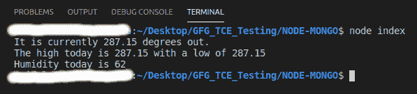

# Node.js 天气预报开放天气图 API

> 原文:[https://www . geesforgeks . org/node-js-open-weather-map-API-for-weather-predictions/](https://www.geeksforgeeks.org/node-js-open-weather-map-api-for-weather-forecasts/)

开放天气地图应用编程接口非常受欢迎，因为它允许您以编程方式请求天气预报和历史天气数据。
**开放天气图 API 特色:**

1.  它很容易上手，也很容易使用。
2.  它是广泛使用和流行的天气预报应用编程接口。

**安装请求模块:**

1.  您可以访问[安装请求模块](https://www.npmjs.com/package/request)的链接。您可以使用此命令安装此软件包。

    ```js
    npm install request
    ```

2.  安装请求模块后，您可以使用命令在命令提示符下检查您的请求版本。

    ```js
    npm version request
    ```

3.  现在去[打开天气图](https://www.google.com/url?sa=t&rct=j&q=&esrc=s&source=web&cd=&ved=2ahUKEwiAxf2ngKvuAhWRX3wKHTFyA-MQFjAAegQIARAD&url=https%3A%2F%2Fopenweathermap.org%2F&usg=AOvVaw018H_9U9cLmoQlvNn8NPy-)网站，创建一个账户，获取你的 API KEY。
4.  之后，您可以创建一个文件夹并添加一个文件，例如 index.js。

```js
node index.js
```

**文件名:index.js**

## index.js

```js
const request = require('request'); 
var API_KEY = 'your_api_key'; 

const forecast = function (latitude, longitude) { 

var url = `http://api.openweathermap.org/data/2.5/weather?`
            +`lat=${latitude}&lon=${longitude}&appid=${API_KEY}`

    request({ url: url, json: true }, function (error, response) { 
        if (error) { 
            console.log('Unable to connect to Forecast API'); 
        } 
          else { 

            console.log('It is currently '
                + response.body.main.temp
                + ' degrees out.'
            ); 

            console.log('The high today is '
                + response.body.main.temp_max 
                + ' with a low of '
                + response.body.main.temp_min
            ); 

            console.log('Humidity today is '
                + response.body.main.humidity
            ); 
        } 
    }) 
} 

var latitude = 22.7196; // Indore latitude 
var longitude = 75.8577; // Indore longitude 

// Function call 
forecast(latitude, longitude); 
```

**运行程序的步骤:**

1.  The project structure will look like this: 

    

2.  使用以下命令确保您已经安装了请求模块:

    ```js
    npm install request
    ```

3.  使用以下命令运行 index.js 文件:

    ```js
    node index.js
    ```



这就是如何使用开放天气地图应用编程接口，它允许你以编程方式请求天气预报和历史天气数据。