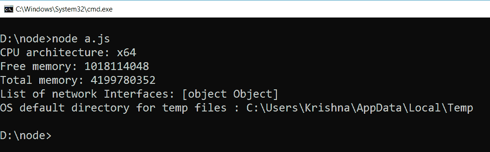
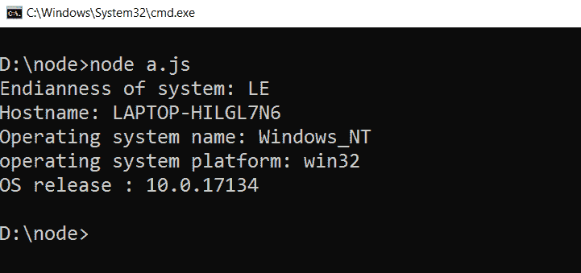

# 节点. js 作业系统

> 原文:[https://www.geeksforgeeks.org/node-js-os/](https://www.geeksforgeeks.org/node-js-os/)

操作系统是用于提供计算机操作系统信息的节点模块。
**优势:**
提供与操作系统交互的功能。它提供操作系统的主机名，并以字节为单位返回可用的系统内存量。
**例 1:**

## java 描述语言

```
// Include os module and create its object
var os = require('os');

// return the cpu architecture
console.log("CPU architecture: " + os.arch());

// It returns the amount of free system memory in bytes
console.log("Free memory: " + os.freemem());

// It return total amount of system memory in bytes
console.log("Total memory: " + os.totalmem());

// It returns the list of network interfaces
console.log('List of network Interfaces: ' + os.networkInterfaces());

// It returns the operating systems default directory for temp files.
console.log('OS default directory for temp files : ' + os.tmpdir ());
```

**输出:**



**例 2:**

## java 描述语言

```
// Include os module and create its object
var os = require('os');

// return the endianness of system
console.log("Endianness of system: " + os.endianness());

// It returns hostname of system
console.log("Hostname: " + os.hostname());

// It return operating system name
console.log("Operating system name: " + os.type());

// It returns the platform of os
console.log('operating system platform: ' + os.platform());

// It returns the operating systems release.
console.log('OS release : ' + os.release());
```

**输出:**

