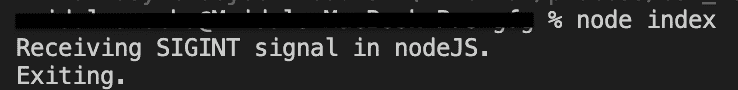
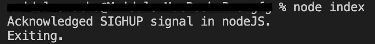

# Node.js process.kill()方法

> 原文:[https://www.geeksforgeeks.org/node-js-process-kill-method/](https://www.geeksforgeeks.org/node-js-process-kill-method/)

**process.kill( pid[，signal] )** 是 node.js 的内置方法，它向 **process** 、 **pid** (这是进程 id)发送信号， **signal** 是要发送的信号的字符串格式。

**语法:**

```
process.kill(pid[, signal])
```

**参数:**该方法接受两个参数，如上所述，如下所述:

*   **pid:** 该参数保存流程标识。
*   **signal:** This parameter holds the string format.

    **信号名称:**这些是字符串格式。

    1.  是 SIGTERM
    2.  信号情报
    3.  嘘嘘嘘

**注意:**如果没有指定信号，那么默认情况下‘SIGTERM’将是信号。

*   **“SIGTERM”****“SIGINT”**信号在非 Windows 平台上有默认的处理程序，在退出前会用代码 128 +信号号重置终端模式。如果其中一个信号安装了侦听器，它在 node.js 上的默认行为将被删除。
*   **‘SIGHUP’**在控制台窗口关闭时生成。

**返回值:**如果没有找到目标 **pid** 或者目标不存在，process.kill()方法会抛出一个错误。如果 pid 存在，该方法返回布尔值 **0** ，并且可以用作目标进程存在的测试。对于窗口用户来说，如果用 **pid** 杀死一组进程，这个方法也会抛出一个错误。

下面的例子说明了 **process.kill()** 属性在 Node.js 中的使用:

**例 1:**

## index.js

```
// Node.js program to demonstrate the 
// process.kill(pid[, signal]) method 

// Printing process signal acknowledged
const displayInfo = () => {
  console.log('Receiving SIGINT signal in nodeJS.');
}

// Initiating a process
process.on('SIGINT', displayInfo);

setTimeout(() => {
  console.log('Exiting.');
  process.exit(0);
}, 100);

// kill the process with pid and signal = 'SIGINT'     
process.kill(process.pid, 'SIGINT');
```

**运行命令:**

```
node index.js
```

**输出:**



**例 2 :**

## index.js

```
// Node.js program to demonstrate the 
// process.kill(pid[, signal]) method 
// Printing process signal acknowledged
const displayInfo = () => {
  console.log('Acknowledged SIGHUP signal in nodeJS.');
}

// Initiating a process
process.on('SIGHUP', displayInfo);

setTimeout(() => {
  console.log('Exiting.');
  process.exit(0);
}, 100);

// kill the process with pid and signal = 'SIGHUP'     
process.kill(process.pid, 'SIGHUP');
```

**运行命令:**

```
node index.js
```

**输出:**



**参考:**[**https://nodejs . org/API/process . html # process _ process _ kill _ PID _ signal**](https://nodejs.org/api/process.html#process_process_kill_pid_signal)