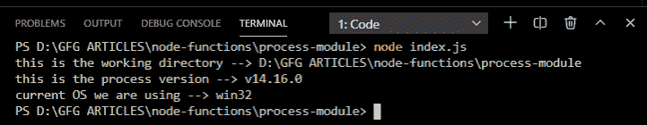

# Node.js 流程对象

> 原文:[https://www.geeksforgeeks.org/node-js-process-object/](https://www.geeksforgeeks.org/node-js-process-object/)

一个**进程**对象是全局对象，所以可以从任何地方访问。因为它是一个预定义的库，所以我们不必在全球范围内将其下载到我们的系统中。

**先决条件:**

*   节点的基本知识
*   已安装 Node.js(版本 12+)
*   NPM 安装(版本 6+)

**要求模块:**您可以使用以下代码包含该模块:

```
var process = require('process');
```

**注意:**是全局对象，不需要显式安装。

**示例 1:** 创建一个 JavaScript 文件 *index.js* 并写下以下代码:

## index.js

```
// Including the module into out project
var process = require('process');

// It will return the current working directory
console.log('this is the working directory --> ' + process.cwd());

// It will return the version of process we are using
console.log('this is the process version --> ' + process.version);

// It will return the type of OS we are using at that time.
console.log('current OS we are using --> ' + process.platform);
```

使用以下命令运行 **index.js** 文件:

```
node index.js
```

**输出:**



**示例 2:** 创建一个 JavaScript 文件 *index.js* 并写下以下代码:

## index.js

```
// Including the module into out project
var process = require('process');

// It will return the Feature Object
console.log('Feature Property: ', process.features);
```

使用以下命令运行 **index.js** 文件:

```
node index.js
```

**输出:**

```
Feature Property:  {   
  inspector: true,     
  debug: false,        
  uv: true,
  ipv6: true,
  tls_alpn: true,      
  tls_sni: true,       
  tls_ocsp: true,      
  tls: true,
  cached_builtins: true
}
```

**参考:**T2】https://nodejs.org/api/process.html#process_process