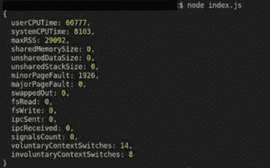

# node . js process . resource usage()函数

> 原文:[https://www . geesforgeks . org/node-js-process-resource usage-function/](https://www.geeksforgeeks.org/node-js-process-resourceusage-function/)

**进程**对象是一个全局对象，它提供关于当前 Node.js 进程的信息和控制。作为一个全局变量，它始终对 Node.js 应用程序可用，而无需使用 require()。也可以使用 require()函数显式访问它。

**process.resourceUsage()** 是返回当前进程资源使用情况的新方法。

**语法:**

```js
process.resourceUsage()
```

**参数:**此功能不接受任何参数。

**返回值:**返回当前进程的资源使用情况。所有这些值都来自 **uv_getrusage 调用**，该调用返回一个 **uv_rusage_t 结构**。

下面的例子说明了 Node.js 中 process.resourceUsage()属性的使用:

**示例:**

## index.js

```js
// Node.js program to demonstrate the  
// process.resourceUsage() Property  

// Include process module  
const process = require('process');  

// Printing process.resourceUsage() property value  
console.log(process.resourceUsage());
```

**运行命令:**

```js
node index.js
```

**输出:**



**注意:**以上程序将使用 node filename.js 命令编译运行。

**参考:**https://nodejs . org/API/process . html # process _ process _ resource usage