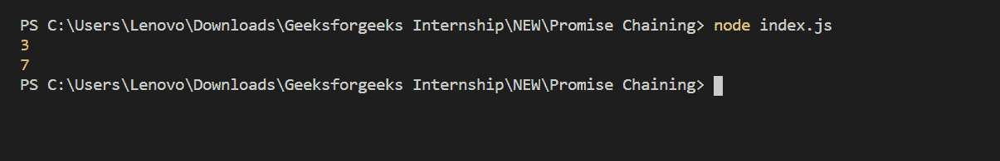

# Node.js 承诺链

> 原文:[https://www.geeksforgeeks.org/node-js-promise-chaining/](https://www.geeksforgeeks.org/node-js-promise-chaining/)

**承诺链接:**承诺链接是一种语法，允许您以特定的顺序将多个异步任务链接在一起。这对于复杂的代码非常有用，在复杂的代码中，一个异步任务需要在另一个异步任务完成后执行。

为了演示承诺链，下面的函数将用于模拟异步任务。实际上，这只是将几个数字相加，等待两秒钟，然后用总和来实现承诺。

**文件名:index.js**

```js
const add = (a, b) => {     
    return new Promise((resolve, reject) => {        
        setTimeout(() => {            
            if (a < 0 || b < 0) {                 
                return reject('Numbers must be non-negative')
            } 
            resolve(a + b)         
        }, 2000) 
    })
}

add(1, 2).then((sum) => {     
    console.log(sum)  // Print 3   
    return add(sum, 4)
}).then((sum2) => {     
    console.log(sum2) // Print 7 
}).catch((e) => { 
    console.log(e) 
});
```

**运行程序的步骤:**

*   Run index.js file using below command:

    ```js
    node index.js
    ```

    

定义了虚拟异步函数后，承诺链可以用来调用 add 两次。下面的代码将 1 和 2 相加，总共是 3。然后，它使用和值 3 作为另一个要添加的调用的输入。第二次调用将 3 和 4 相加，总计为 7。

当回调函数返回一个承诺时，就会发生承诺链接。它允许你链接到另一个通话，当第二个承诺实现时，该通话将运行。仍然可以调用 Catch 来处理过程中可能出现的任何错误。