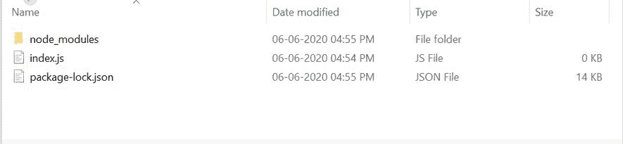

# Node.js 提示. get()方法

> 原文:[https://www.geeksforgeeks.org/node-js-prompt-get-method/](https://www.geeksforgeeks.org/node-js-prompt-get-method/)

**prompt.get()** 方法是一个异步函数。除了用于复杂属性验证的对象之外，此方法还采用表示属性名称的字符串(等等)。该功能用于输入/输出操作。

**语法:**

```
prompt.get([object]/[properties name], callbackfunction)

```

**参数:**该方法取两个参数，如下图:

1.  **【对象】/【属性名称】:**该参数保存输入值或预定义对象的属性。
2.  **callbackfunction:** 此参数保存回调函数，使该函数成为异步函数。

**安装模块:**

1.  可以访问[安装](https://www.npmjs.com/package/prompt)这个模块的链接。您可以使用此命令安装此软件包。

```
npm install prompt

```

*   After that, you can just create a folder and add a file for example, index.js. To run this file you need to run the following command.

    ```
    node index.js

    ```

    **文件名:Index.js**

    ```
    var prompt = require('prompt');

    // Function call
    prompt.start();

    // Reading two properties from user ie. name & class
    prompt.get(['Name', 'class'], function (err, result) {

      // Printing the result
      console.log('Command-line input received:');
      console.log('Name: ' + result.name);
      console.log('class: ' + result.class);
    })
    ```

    **项目结构:**

    

    使用以下命令运行 **index.js** 文件:

    ```
    node index.js
    ```

    **输出:**

    ```
    prompt: name: some-user
    prompt: class: 12th
    Command-line input received:
    name: some-user
    class: 12th

    ```