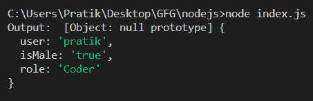

# Node.js querystring.decode()函数

> 原文:[https://www . geesforgeks . org/node-js-query string-decode-function/](https://www.geeksforgeeks.org/node-js-querystring-decode-function/)

**querystring.decode** ()方法用于将一个网址查询字符串解析为一个对象，该对象包含查询网址的键值和对值。返回的对象没有从 JavaScript 对象继承原型，因此通常的对象方法不起作用。在解析过程中，除非有替代的字符编码格式，否则将采用 UTF-8 编码格式。要解码替代字符编码，必须指定 decodeURIComponent 选项。

**语法**:

```js
querystring.decode( str, sep, eq, options )
```

**参数**:该功能接受四个参数，如上所述，描述如下:

*   **字符串**:指定需要解析的网址查询的字符串。
*   **sep** :指定用于分隔指定查询字符串中键和值对的子字符串的字符串。默认值为“&”。
*   **eq** :指定用于分隔指定查询字符串中的键和值的子字符串的字符串。默认值为“=”。
*   **选项**:是可以用来修改方法行为的对象。它具有以下参数:
    *   **decodeURIComponent** :这是一个用于解码查询字符串中百分比编码字符的函数。默认值为 querystring.unescape()。
    *   **maxKeys** :是一个数字，它指定了应该从查询字符串中解析的最大键数。值“0”将删除所有计数限制。默认值为“1000”。

**返回值**:返回一个从查询字符串中解析出键值对的对象。

**例 1:**

## java 描述语言

```js
const querystring = require('querystring');

let str = "user=pratik&isMale=true&role=Coder";

let output = querystring.decode(str);

console.log("Output: ", output);
```

**输出:**



**例 2:**

## java 描述语言

```js
const querystring = require('querystring');

let str = "user->pratik/isMale->true/role->Coder/role->Engineer";

let output = querystring.decode(str, '/', '->');

console.log("Output 1 : ", output);

output = querystring.decode(str, '/', '->', {maxKeys: 2});

console.log("Output 2 : ", output);
```

**输出:**

**参考:**[https://nodejs . org/API/query string . html # query string _ query string _ decode](https://nodejs.org/api/querystring.html#querystring_querystring_decode)