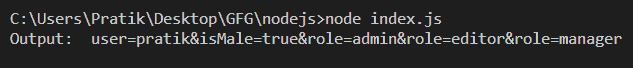
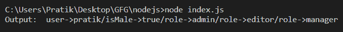

# Node.js querystring.encode()函数

> 原文:[https://www . geesforgeks . org/node-js-query string-encode-function/](https://www.geeksforgeeks.org/node-js-querystring-encode-function/)

**querystring.encode** ()方法用于从包含键值对的给定对象中生成一个 URL 查询字符串。方法迭代对象自身的属性以生成查询字符串。

它可以序列化字符串、数字和布尔值的单个或数组。任何其他类型的值都被强制为空字符串。

在序列化过程中，UTF-8 编码格式用于编码任何需要百分制编码的字符。要使用替代字符编码进行编码，必须指定 encodeURIComponent 选项。

**语法:**

```
querystring.encode( obj, sep, eq, options )
```

**参数**:该功能接受四个参数，如上所述，描述如下:

*   **obj** :必须序列化为网址查询字符串的对象。
*   **sep** :指定用于分隔查询字符串中键和值对的子字符串的字符串。默认值为“&”。
*   **eq** :指定用于分隔查询字符串中键和值的子字符串的字符串。默认值为“=”。
*   **选项**:是一个可以用来修改方法行为的对象。它具有以下参数:
    *   **encodeURIComponent** :这是一个用于将查询字符串中不安全的网址字符转换为百分比编码的函数。默认值为 querystring.escape()。

**返回值**:返回一个包含给定对象产生的网址查询的字符串。

**例 1:**

## java 描述语言

```
const querystring = require('querystring');

let obj = {
    user: "pratik", 
    isMale: true, 
    role: ["admin", "editor", "manager"], 
}

let output = querystring.encode(obj);

console.log("Output: ", output);
```

**输出:**



**例 2:**

## java 描述语言

```
const querystring = require('querystring');

let obj = {
    user: "pratik", 
    isMale: true, 
    role: ["admin", "editor", "manager"], 
}

let output = querystring.encode(obj, '/', '->');

console.log("Output: ", output);
```

**输出:**



**参考:**[https://nodejs . org/API/query string . html # query string _ query string _ enco](https://nodejs.org/api/querystring.html#querystring_querystring_encode)