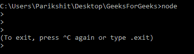
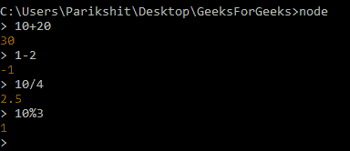
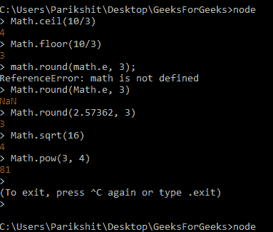
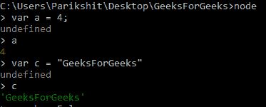
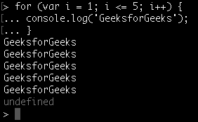
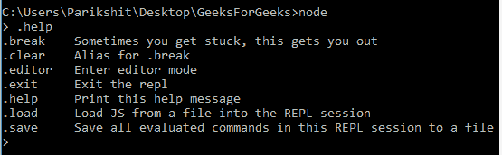

# Node.js REPL(读取、EVAL、打印、循环)

> 原文:[https://www . geesforgeks . org/node-js-repl-read-eval-print-loop/](https://www.geeksforgeeks.org/node-js-repl-read-eval-print-loop/)

**Node.js** 是基于 [Chrome 的 JavaScript Engine(V8)](https://developers.google.com/v8/) 构建的开源服务器端 [Javascript](https://www.geeksforgeeks.org/javascript-tutorial/) 运行时环境。Node.js 用于构建快速且可扩展的应用程序，是一个事件驱动的非阻塞 I/O 模型。

**REPL (READ、EVAL、PRINT、LOOP)** 是一个类似 Shell (Unix/Linux)和命令提示符的计算机环境。安装时，节点附带 REPL 环境。系统通过输出使用的命令/表达式与用户交互。它在编写和调试代码时非常有用。REPL 的作品可以从其完整的形式来理解:

**Read** :读取用户的输入，解析成 JavaScript 数据结构。然后存储到内存中。
**评估**:对解析后的 JavaScript 数据结构进行结果评估。
**打印**:评估后打印结果。
**循环**:循环输入命令。要从 NODE REPL 出来，按两次 **ctrl+c**

**开始使用 REPL:**
开始使用 NODE 的 REPL 环境；打开终端(在 UNIX/LINUX 的情况下)或命令提示符(在 Windows 的情况下)并写下**节点**并按“回车”启动 REPL。

开放节点复制器

REPL 已经开始，用“>”符号来划分。可以在 REPL 上执行各种操作。下面是一些熟悉 REPL 环境的例子。

**示例:**在 REPL 执行算术运算

REPL 的算术运算

**示例:**使用 NODE 的库执行操作。**数学**库正在下面的例子中使用。

数学库方法

**注意:**使用**【数学】**显示错误，因为库在 NODE 中被引用为**【数学】**，而不是**【数学】**。

**示例:**使用 REPL 的变量。关键字 **var** 用于给变量赋值。

在 REPL 使用变量

**示例:**在 REPL 使用**循环**。循环可以在 REPL 和其他编辑器中使用。

**注意:**使用**ctrl–c**终止命令，使用**ctrl–c**两次终止 NODE REPL。
**。帮助**用于列出所有命令。

使用。在 REPL 的帮助