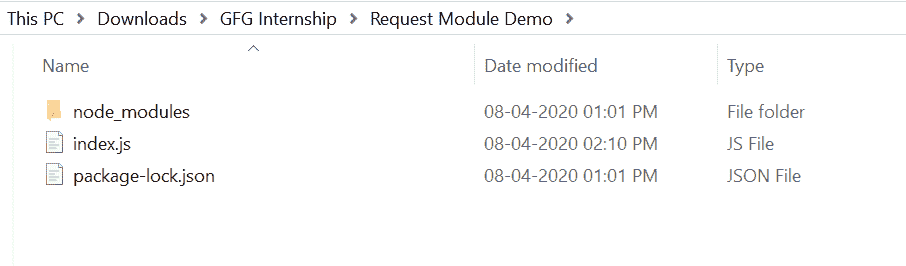
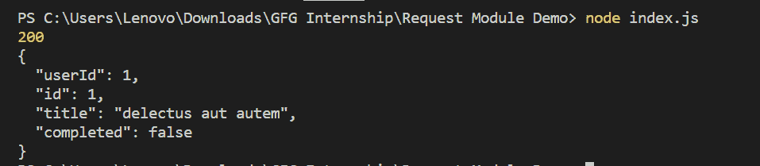

# 节点 js 请求模块

> 原文:[https://www.geeksforgeeks.org/node-js-request-module/](https://www.geeksforgeeks.org/node-js-request-module/)

请求模块用于进行 HTTP 调用。使用这个请求模块在 node.js 中进行 HTTP 调用是最简单的方法。默认情况下，它遵循重定向。

**请求模块的功能:**

1.  它很容易上手，也很容易使用。
2.  它是一个广泛使用和流行的模块，用于进行 HTTP 调用。

**安装请求模块:**

1.  您可以访问链接[安装请求模块](https://www.npmjs.com/package/request)。您可以使用此命令安装此软件包。

    ```js
    npm install request
    ```

2.  安装请求模块后，您可以使用命令在命令提示符下检查您的请求版本。

    ```js
    npm version request
    ```

3.  之后，您可以创建一个文件夹并添加一个文件，例如 index.js。

    ```js
    node index.js
    ```

**文件名:index.js**

```js
const request = require('request')

// Request URL
var url = 'https://jsonplaceholder.typicode.com/todos/1';

request(url, (error, response, body)=>{

    // Printing the error if occurred
    if(error) console.log(error)

    // Printing status code
    console.log(response.statusCode);

    // Printing body
    console.log(body);
}); 
```

**运行程序的步骤:**

1.  项目结构会是这样的:
    
2.  确保您已经使用以下命令安装了快速和请求模块:

    ```js
    npm install request
    ```

    ```js
    npm install express
    ```

3.  Run index.js file using below command:

    ```js
    node index.js
    ```

    

这就是如何使用请求模块进行 HTTP 调用。它非常简单易用。