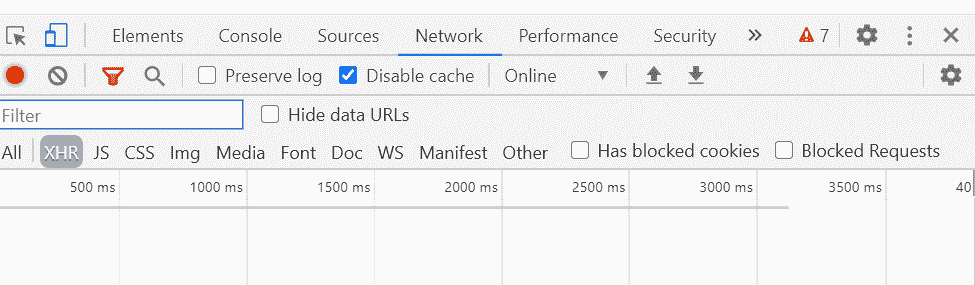

# 节点. js 用头盔. js 保护应用

> 原文:[https://www . geesforgeks . org/node-js-securing-apps-with-头盔-js/](https://www.geeksforgeeks.org/node-js-securing-apps-with-helmet-js/)

**头盔. js** 是一个 Node.js 模块，帮助保护 HTTP 头。它在快速应用程序中实现。因此，我们可以说，头盔. js 有助于保护快速应用程序。它设置了各种 HTTP 头来防止像跨站点脚本(XSS)、点击劫持等攻击。

**为什么 HTTP 头的安全性很重要:**有时候开发人员会忽略 HTTP 头。由于 HTTP 头可能会泄露有关应用程序的敏感信息，因此，以安全的方式使用头非常重要。

**节点-头盔. js 中包含的模块有:**头盔. js 自带更多内置模块，增加了 Express 应用的安全性。

*   **内容-安全-策略:**设置安全策略。
*   **Expect-CT:** 用于处理证书透明度。
*   **X-DNS-预取-控制:**用于控制浏览器 DNS 的取数。
*   **X-Frame-Options:** 用于防止点击劫持。
*   **X-power-By:**用于移除 X-power-By 表头。x-power-By 头泄露了服务器及其供应商的版本。
*   **公钥锁定:**用于 HTTP 公钥锁定。
*   **严格-传输-安全:**用于 HTTP 严格传输策略。
*   **X-下载-选项:**限制为各种下载-选项。
*   **缓存控制:**用于禁用客户端缓存。
*   **X-内容-类型-选项:**用于防止嗅探攻击。
*   **引荐者-策略:**用于隐藏引荐者头。
*   **X-XSS-防护:**用于为 XSS 攻击增加防护。

**如何检查 HTTP 标头:**要检查标头，首先右键单击要检查的页面。现在，点击**检查元素**。之后打开**网络**标签。网络页签会是这样的:

一开始是空的。在网络选项卡中，将显示浏览器发出的所有 HTTP 请求。

**先决条件:**

1.  您选择的集成开发环境。
2.  Node.js 安装在您的系统中。
3.  了解 Node.js 和 express 应用程序。

**设置基本快递应用程序:**

1.  首先用 **package.json** 文件初始化应用程序。写下以下命令:

    ```js
    npm init
    ```

2.  Install express module by using the following command:

    ```js
    npm install express --save
    ```

    下面显示的是我们的 package.json 文件:

    ```js
    {
      "name": "HelmetJs",
      "version": "1.0.0",
      "description": "",
      "main": "index.js",
      "scripts": {
        "test": "echo \"Error: no test specified\" && exit 1"
      },
      "author": "Pranjal Srivastava",
      "license": "ISC",
      "dependencies": {
        "express": "^4.17.1",
      }
    }

    ```

3.  创建一个文件，我们将在其中编写 javascript 代码。例如 **app.js** 。你可以随意命名你的文件。现在，编写以下设置服务器的代码:

    ```js
    const express = require('express');
    const app = express();

    app.get('/', (req, res) => {
        res.send("This is the Demo page for"
           + " setting up express server !")
    });

    app.listen(3000, (err) => {
        if (err) { console.log(err); }
        else { console.log('Server started "
            + "at http://localhost:3000'); }
    });
    ```

4.  Run app.js file with the following command:

    ```js
    node app.js
    ```

    上述命令的输出如下所示:

    ```js
    Server started at http://localhost:3000
    ```

5.  打开浏览器，转到 *http://localhost:3000* 。再次打开**网络**选项卡，您将看到浏览器发出的请求列表。选择**本地主机**请求，您将看到如下响应标题列表:

    ```js
    HTTP/1.1 304 Not Modified
    X-Powered-By: Express
    ETag: W/"35-QqeUaYjSJ35gtyT3DcgtpQlitTU"
    Date: Thu, 04 Jun 2020 15:55:00 GMT
    Connection: keep-alive

    ```

**在快速应用程序中设置和实现头盔显示器:**

1.  要安装**头盔. js** 模块，请编写以下命令:

    ```js
    npm install helmet --save
    ```

2.  在 **app.js** 文件中，编写以下代码来使用头盔模块:

    ```js
    const express = require('express');
    const helmet = require('helmet');
    const app = express();

    app.use(helmet());

    app.get('/', (req, res) => {
        res.send("This is the Demo page for"
            + " setting up express server !")
    });

    app.listen(3000, (err) => {
        if (err) { console.log(err); }
        else { console.log('Server started "
            + "at http://localhost:3000'); }
    });
    ```

3.  使用以下命令启动服务器:

    ```js
    node app.js
    ```

4.  Open the **Network** tab by clicking on Inspect Element. Click on **localhost** and you will notice an additional set of headers in response. The headers are as follows:

    ```js
    HTTP/1.1 304 Not Modified
    X-DNS-Prefetch-Control: off
    X-Frame-Options: SAMEORIGIN
    Strict-Transport-Security: max-age=15552000; includeSubDomains
    X-Download-Options: noopen
    X-Content-Type-Options: nosniff
    X-XSS-Protection: 1; mode=block
    ETag: W/"35-QqeUaYjSJ35gtyT3DcgtpQlitTU"
    Date: Thu, 04 Jun 2020 16:11:37 GMT
    Connection: keep-alive

    ```

    这里，我们的**头盔. js** 模块应用了新的头部集合。添加这些标头是为了提高安全性。

**结论:** **头盔. js** 模块对 NodeJs 开发者非常有用，因为它增加了快速应用的安全性。在本教程中，我们学习了头盔. js，并在一个基本的 express 应用程序中看到了它的实现。