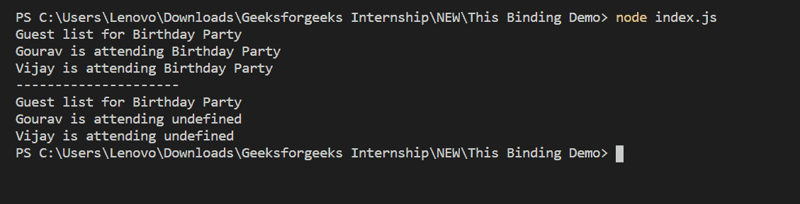

# 节点. js 本次绑定

> 原文:[https://www.geeksforgeeks.org/node-js-this-binding/](https://www.geeksforgeeks.org/node-js-this-binding/)

箭头函数不绑定自己的“this”值。相反，定义它的范围的“this”值是可访问的。这使得 arrow 函数成为方法的不良候选者，因为这不会是对定义该方法的对象的引用。

对于方法，ES6 提供了一种新的方法定义语法。您可以在下面 printGuestList 方法的定义中看到这一点。该函数是一个标准函数，只是有一个允许删除冒号和函数关键字的简写语法。

因为箭头函数不绑定这个，所以除了方法之外，它们可以很好地工作。如下所示，传递给 forEach 的 arrow 函数能够正确地访问这个. name，因为它被定义为 arrow 函数，并且没有自己的绑定。如果你把箭头函数换成标准函数，这段代码就不能用了。

创建一个文件夹并添加一个文件，例如`index.js`。要运行此文件，您需要运行以下命令。

```js
node index.js
```

**文件名:index.js**

```js
// 'This' in Arrow function
const eventOne = {
    name: 'Birthday Party',
    guestList: ['Gourav', 'Vijay'],
    printGuestList() {
        console.log('Guest list for ' + this.name);
        this.guestList.forEach((guest) => {
            console.log(guest + ' is attending ' + this.name)
        });
    }
}

// 'This' in normal function
const eventTwo = {
    name: 'Birthday Party',
    guestList: ['Gourav', 'Vijay'],
    printGuestList() {
        console.log('Guest list for ' + this.name);
        this.guestList.forEach(function (guest) {
            console.log(guest + ' is attending ' + this.name)
        });
    }
}

eventOne.printGuestList();
console.log('---------------------');
eventTwo.printGuestList();
```

**运行程序的步骤:**

*   Run index.js file using the following command:

    ```js
    node index.js
    ```

    

这就是‘this’绑定在箭头函数和普通函数上的工作方式。