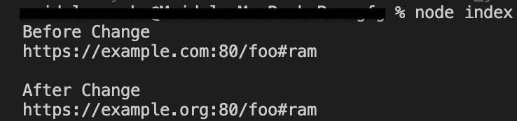

# Node.js URL.hostname API

> 原文:[https://www.geeksforgeeks.org/node-js-url-hostname-api/](https://www.geeksforgeeks.org/node-js-url-hostname-api/)

**url.hostname** 是内置于 **url** 模块中的类 **url** 的应用编程接口，用于获取和设置 URL 的主机名部分。 **url.host** 和 **url.hostname** 的关键区别在于 **url.hostname** 不包括端口。

**语法:**

```
const url.hostname
```

**返回值:**获取并设置 URL 的主机名部分。
以下程序说明了 **url.hostname** 方法的使用:
**示例 1:**

## java 描述语言

```
// node program to demonstrate the 
// url.hostname API as Setter 

//importing the module 'url'
const http = require('url');

// creating and initializing myURL
const myURL = new URL('https://example.com:80/foo#ram');

// Display href value of myURL before change
console.log("Before Change");
console.log(myURL.href);

// assigning hostname portion
// using hostname
console.log();
myURL.hostname = 'example.org';

// Display href value of myURL after change
console.log("After Change");
console.log(myURL.href);
```

**输出** :



**例 2:**

## java 描述语言

```
// node program to demonstrate the 
// url.hostname API as Getter 

//importing the module 'url'
const http = require('url');

// creating and initializing myURL
const myURL = new URL('https://example.org/foo#ram');

// getting the hostname portion
// using hostname
const hostname = myURL.hostname;

// Display hostname value 
console.log(hostname);
```

**输出:**


**注意:**以上程序将使用节点 myapp.js 命令编译运行。
**参考:**
[https://nodejs . org/dist/latest-v10 . x/docs/API/URL . html # URL _ URL _ host](https://nodejs.org/dist/latest-v10.x/docs/api/url.html#url_url_host)