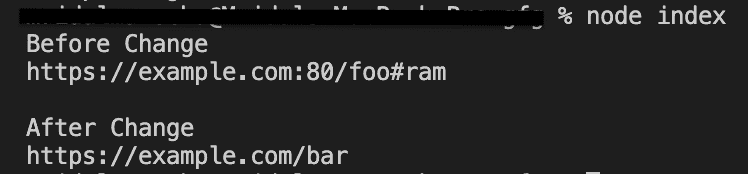

# Node.js URL.href API

> 原文:[https://www.geeksforgeeks.org/node-js-url-href-api/](https://www.geeksforgeeks.org/node-js-url-href-api/)

**url.href** 是一个内置的应用编程接口类 **url** ，在 **url** 模块中获取和设置序列化的 URL。获取 href 属性的值相当于调用 **url.toString()** 方法。将此属性的值设置为新值相当于使用新的 URL(值)创建新的 URL 对象。每个网址对象的属性都将被修改。

**语法:**

```js
const url.href 
```

**返回值:**获取并设置序列化后的网址。
下面的程序说明了**的使用方法:
**示例 1:****

## java 描述语言

```js
// node program to demonstrate the 
// url.href API as Setter 

//importing the module 'url'
const http = require('url');

// creating and initializing myURL
const myURL = new URL('https://example.com:80/foo#ram');

// Display href value of myURL before change
console.log("Before Change");
console.log(myURL.href);

// assigning serialized URL
// using href
console.log();
myURL.href = 'https://example.com/bar';

// Display href value of myURL after change
console.log("After Change");
console.log(myURL.href);
```

**输出** :



**例 2:**

## java 描述语言

```js
// node program to demonstrate the 
// url.href API as Getter 

//importing the module 'url'
const http = require('url');

// creating and initializing myURL
const myURL = new URL('https://example.org/foo#ram');

// getting the serialized URL
// using href
const href = myURL.href;

// Display hostname value 
console.log(href);
```

**输出:**


**参考:**
[https://nodejs . org/API/URL . html # URL _ href](https://nodejs.org/api/url.html#url_url_href)