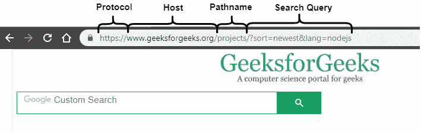
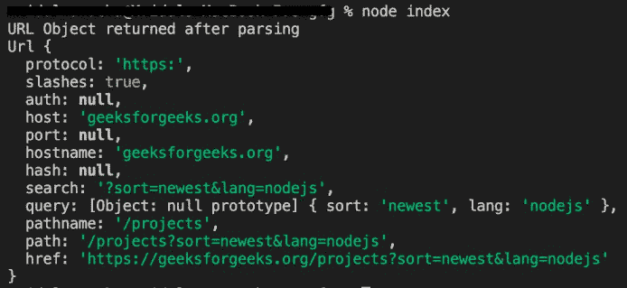
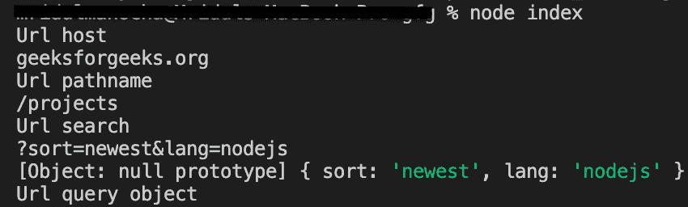

# Node.js url.parse(urlString、parseQueryString、slashesdenothest)API

> 哎哎哎:# t0]https://www . geeksforgeeks . org/node-js-URL-parse urlstring-parse query string-slashesdenothost API/

**url.parse()** 方法取一个 url 字符串，解析它，它将返回一个 URL 对象，地址的每个部分作为属性。

**语法:**

```
url.parse( urlString, parseQueryString, slashesDenoteHost)
```

**参数:**该方法接受三个参数，如上所述，如下所述:

*   **urlString:** 保存需要解析的 URL 字符串。
*   **parseQueryString:** 是布尔值。如果设置为 true，则查询属性将被设置为由 querystring 模块的 parse()方法返回的对象。如果设置为 false，则返回的 URL 对象的查询属性将是一个未分析、未编码的字符串。它的默认值是 false。
*   **slashesdenothest:**是布尔值。如果设置为 true，则文字字符串//之后、下一个/之前的第一个标记将被解释为主机。例如://geesforgeeks . org/web-technology 包含结果{ host:' geesforgeeks . org '，pathname: '/web-technology'}而不是{ pathname:'//geesforgeeks . org/web-technology ' }。它的默认值是 false。

**返回值:****URL . parse()**方法返回一个对象，地址的每个部分都作为属性。
**注:**

*   如果 urlString 不是字符串，则它会引发类型错误。
*   如果 auth 属性存在但没有被解码，那么它会抛出 URIError。



**例 1:**

## java 描述语言

```
// Node program to demonstrate the  
// url.parse() method  

// Importing the module 'url'
const url = require('url');

// URL address
const address = 'https://geeksforgeeks.org/projects?sort=newest&lang=nodejs';

// Call parse() method using url module
let urlObject = url.parse(address, true);

console.log('URL Object returned after parsing');

// Returns an URL Object
console.log(urlObject)
```

**输出:**



**示例 2:** 这个示例说明了 url 对象的属性。

## java 描述语言

```
// Node program to demonstrate the  
// url object properties  

// Get different parts of the URL
// using object properties
const url = require('url');

// URL address
const address = 
'https://geeksforgeeks.org/projects?sort=newest&lang=nodejs';

// Call parse() method using url module
let urlObject = url.parse(address, true);

console.log('Url host');

// Returns 'geeksforgeeks.org'
console.log(urlObject.host); 
console.log('Url pathname');

// Returns '/projects'
console.log(urlObject.pathname); 
console.log('Url search');

// Returns '?sort=newest&lang=nodejs'
console.log(urlObject.search); 

// Get query data as an object
// Returns an object: 
// { sort: 'newest', lang: 'nodejs' }
let queryData = urlObject.query; 
console.log(queryData);
console.log('Url query object');

// Returns 'nodejs'
console.log(queryData.lang); 
```

**输出:**



**注意:**以上程序将使用**节点 myapp.js** 命令编译运行。
**参考:**[https://nodejs . org/docs/latest/API/URL . html # URL _ URL _ parse _ URL string _ parsequerystring _ slashesdenothest](https://nodejs.org/docs/latest/api/url.html#url_url_parse_urlstring_parsequerystring_slashesdenotehost)