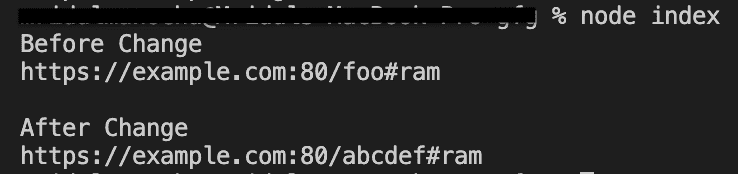

# Node.js URL.pathname API

> 原文:[https://www.geeksforgeeks.org/node-js-url-pathname-api/](https://www.geeksforgeeks.org/node-js-url-pathname-api/)

**url.pathname** 是一个内置的 **url** 类应用编程接口，带有 **url** 模块，用于获取和设置 URL 的路径名部分。

**语法:**

```
const url.pathname
```

**返回值:**获取并设置 URL 的路径名部分。

以下程序说明了**方法的使用:**

**例 1:**

## java 描述语言

```
// node program to demonstrate the 
// url.pathname API as Setter 

//importing the module 'url'
const http = require('url');

// creating and initializing myURL
const myURL = new URL('https://example.com:80/foo#ram');

// Display the href
// value of myURL before change
console.log("Before Change");
console.log(myURL.href);

// assigning pathname portion
// using pathname API
console.log();
myURL.pathname = '/abcdef';

// Display href 
// value of myURL after change
console.log("After Change");
console.log(myURL.href);
```

**输出**:



**例 2:**

## java 描述语言

```
// node program to demonstrate the 
// url.pathname API as Getter 

//importing the module 'url'
const http = require('url');

// creating and initializing myURL
const myURL = new URL('https://example.org/123abc#ram');

// getting the pathname portion
// using pathname
const pathname = myURL.pathname;

// Display pathname value 
console.log("pathname is : " + pathname);
```

**输出:**


**注意:**上述程序将使用节点上的**节点 myapp.js 命令**编译运行。

**参考:**
[https://nodejs . org/API/URL . html # URL _ URL _ path name](https://nodejs.org/api/url.html#url_url_pathname)