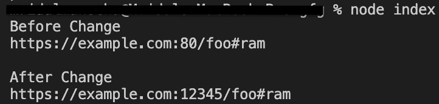
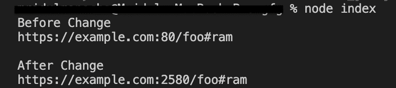
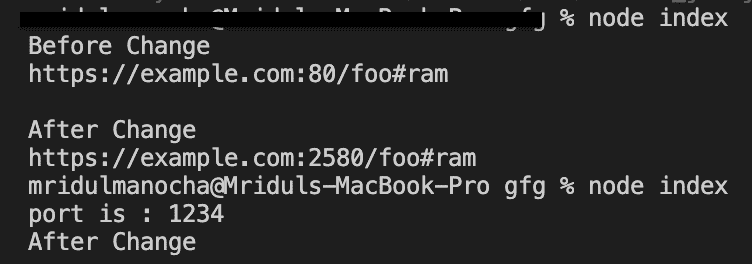

# Node.js URL.port API

> 原文:[https://www.geeksforgeeks.org/node-js-url-port-api/](https://www.geeksforgeeks.org/node-js-url-port-api/)

**url.port** 是 **url** 模块中类 **url** 的内置应用编程接口，用于获取和设置 URL 的端口部分，端口值可以是一个数字或包含 0 到 65535(含)范围内的数字的字符串。将该值设置为给定协议的 URL 对象的默认端口将导致端口值变成空字符串(")。
端口值可以是空字符串，在这种情况下端口取决于协议/方案:

<figure class="table">

| protocol | port |
| --- | --- |
| 【文件传输协议】 | Twenty-one |
| [file] |  |  | 【地鼠】 | Seventy |

</figure>

为端口赋值后，该值将首先使用**转换为字符串。toString()** 。
如果该字符串无效，但以数字开头，则前导数字被分配给端口。如果该数字位于上述范围之外，将被忽略。

**语法:**

```js
const url.port
```

**返回值:**获取并设置 URL 的端口部分。

以下程序说明了**网址端口**方法的使用:

**例 1:**

## java 描述语言

```js
// node program to demonstrate the 
// url.port API as Setter 

//importing the module 'url'
const http = require('url');

// creating and initializing myURL
const myURL = new URL('https://example.com:80/foo#ram');

// Display href and port
// value of myURL before change
console.log("Before Change");
console.log(myURL.href);

// assigning port portion
// using port API
console.log();
myURL.port = '12345';

// Display href and password
// value of myURL after change
console.log("After Change");
console.log(myURL.href);
```

**输出**:



**例 2:如果端口号是半数字半字母**

## java 描述语言

```js
// node program to demonstrate the 
// url.port API as Setter 

//importing the module 'url'
const http = require('url');

// creating and initializing myURL
const myURL = new URL('https://example.com:80/foo#ram');

// Display href and port
// value of myURL before change
console.log("Before Change");
console.log(myURL.href);

// assigning port portion
// using port API
console.log();
myURL.port = '2580abcd';

// Display href and password
// value of myURL after change
console.log("After Change");
console.log(myURL.href);
```

**输出**:



**例 3:**

## java 描述语言

```js
// node program to demonstrate the 
// url.port API as Getter 

//importing the module 'url'
const http = require('url');

// creating and initializing myURL
const myURL = new URL('https://example.org/foo#ram');
myURL.port = '1234'

// getting the port portion
// using port
const port = myURL.port;

// Display port value 
console.log("port is : " + port);

//"https" default port is 443
console.log("After Change");
myURL.port = '443';
console.log(myURL.port);
```

**输出:**



**注意:**上述程序将使用节点上的 **myapp.js 命令**编译运行。

**参考:**
[https://nodejs . org/API/URL . html # URL _ port](https://nodejs.org/api/url.html#url_url_port)