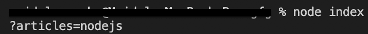
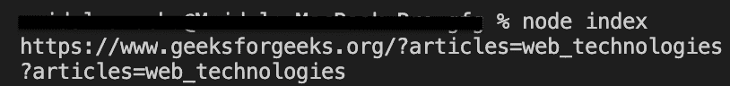

# Node.js URL.search API

> 原文:[https://www.geeksforgeeks.org/node-js-url-search-api/](https://www.geeksforgeeks.org/node-js-url-search-api/)

**网址搜索**是**节点内**网址类**的内置应用编程接口。JS** 。
**URL.search** API 用于获取和设置 URL 的查询部分。

```js
Syntax: url.search
url : It is an object created by URL constructor.
```

**示例 1:(获取网址的查询字符串)**

## java 描述语言

```js
//Creating an URL_1 object with URL constructor.
const URL_1 = new URL("https://www.geeksforgeeks.org/?articles=nodejs");

//Getting query string of above created URL_1 object
console.log(URL_1.search);
```

**输出:**



**示例 2:(设置网址的查询字符串)**

## java 描述语言

```js
//Creating an URL_1 object with URL constructor.
const URL_1 = new URL("https://www.geeksforgeeks.org");

//Setting query string for URL_1
URL_1.search = "articles=web_technologies";

console.log(URL_1.href);

//Getting query string after setting 
console.log(URL_1.search);
```

**输出:**

