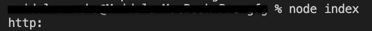

# node . js urlobject . protocol API

> 原文:[https://www . geesforgeks . org/node-js-URL object-protocol-API/](https://www.geeksforgeeks.org/node-js-urlobject-protocol-api/)

借助`**urlObject.protocol()**`方法，我们可以找到给定主机名使用的协议名称。

> **语法:** `**urlObject.protocol()**`
> **返回:**返回使用的协议(即–http、https、ftp 等。)

**示例#1 :** 在本例中，借助`**urlObject.protocol()**`方法，我们能够从主机名中提取所使用的协议。

```js
// Importing the module 'url' 
const url = require('url');

var adr = 
'http://localhost:8080/default.htm?year=2019&month=may';

// Parse the address:
var q = url.parse(adr, true);

/* The parse method returns an object containing
 URL properties */

console.log(q.protocol);
```

**输出:**


**例 2 :**

```js
// Importing the module 'url' 
const url = require('url');

var adr = 
'https://localhost:8080/default.htm?year=2k19&month=geekofthemonth';

// Parse the address:
var q = url.parse(adr, true);

/* The parse method returns an object containing
 URL properties */

console.log(q.protocol);
```

**输出:**
