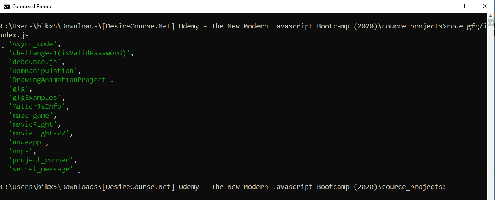
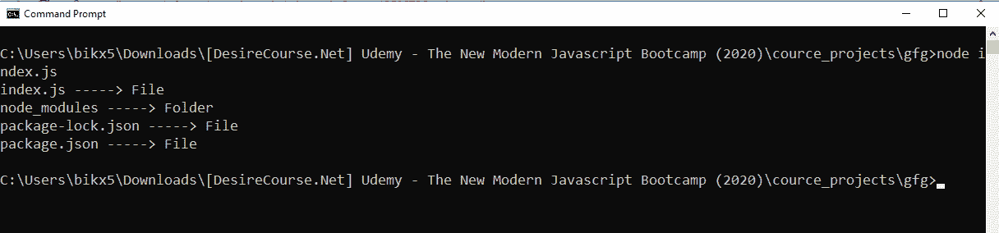

# Node.js util.promisify()方法

> 原文:[https://www . geesforgeks . org/node-js-util-promisify-method/](https://www.geeksforgeeks.org/node-js-util-promisify-method/)

**util.promisify()** 方法在 Node.js 标准库的 utilities 模块中定义。它基本上用于转换使用回调函数返回响应的方法，以返回 promise 对象中的响应。通常，由于回调嵌套或回调地狱，很快就很难使用回调了。组织或格式化我们的代码变得非常困难，以至于其他开发人员如果使用该代码，可以很容易地理解它。另一方面，处理承诺非常容易，因为嵌套承诺也以线性方式操作，即承诺链接。util.promisify()方法为我们做到了这一点，并使该方法能够使用诺言进行操作。

**语法:**

```
util.promisify(func)
```

**参数:**这个方法接受一个单参数**函数**，它保存基于回调的函数。

**返回值:**这个方法返回一个基于承诺的函数。

**例 1:**

```
// Node.js program to illustrate 
// util.promisify() methods

// Importing Utilities module
const util = require('util')

// Importing File System module
const fs = require('fs')

// Use promisify to convert callback
// based method fs.readdir to 
// promise based method
const readdir = util.promisify(fs.readdir)

readdir('process.cwd()')
  .then(files => {
    console.log(files)
  })
  .catch(err => {
    console.log(err)
  })
```

**输出:**

```
[Error: ENOENT: no such file or directory, 
scandir 'C:\Users\bhudk\Desktop\nodec\process.cwd()'] {
  errno: -4058,
  code: 'ENOENT',
  syscall: 'scandir',
  path: 'C:\\Users\\bhudk\\Desktop\\nodec\\process.cwd()'
}
```

**例 2:**

```
// Node.js program to illustrate 
// util.promisify() methods

// Since promisify function 
// returns promise version 
// of a function, it can also
// operate using async and await

// Importing Utilities module
const util = require('util')

// Importing File System module
const fs = require('fs')

// Use promisify to convert callback
// based method fs.readdir to 
// promise based method
const readdir = util.promisify(fs.readdir)

const readFiles = async (path) => {
    const files = await readdir(path)
    console.log(files)
  }

  readFiles(process.cwd()).catch(err => {
    console.log(err)
  })
```

**输出:**


**例 3:**

```
// Node.js program to illustrate 
// util.promisify() methods

// Importing Utilities module
const util = require('util')

importing File System module
const fs = require('fs')

// Use promisify to convert 
// callback based methods to 
// promise based methods
const readdir = util.promisify(fs.readdir)
const lstat = util.promisify(fs.lstat)

const readFiles = async (path) => {
  const files = await readdir(path)
  for (let file of files) {
    const stats = await lstat(file)
    if (stats.isFile()) {
      console.log(`${file} -----> File`)
    } else {
      console.log(`${file} -----> Folder`)
    }
  }
}

readFiles('process.cwd()').catch(err => {
  console.log(err)
})
```

**输出:**


**参考:**[https://nodejs . org/API/util . html # util _ util _ promisify _ original](https://nodejs.org/api/util.html#util_util_promisify_original)