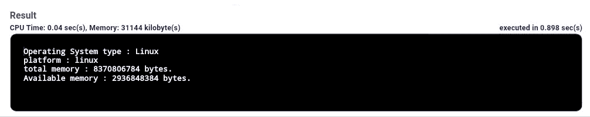
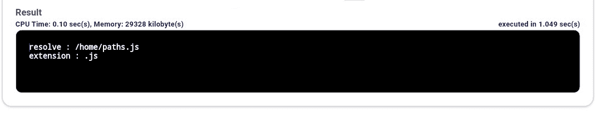
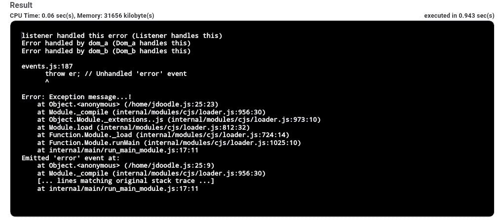

# Node.js 实用模块

> 原文:[https://www.geeksforgeeks.org/node-js-utility-module/](https://www.geeksforgeeks.org/node-js-utility-module/)

**Node.js 实用模块:**node . js 中的 Util 模块提供对各种实用功能的访问。

**语法:**

```
var util = require('util');
```

node.js 模块库中有各种实用程序模块。这些模块在开发基于节点的 web 应用程序时非常有用。
node . js 中存在的各种实用程序模块如下:

**操作系统模块:**基于操作系统的节点. js 实用程序模块由操作系统模块提供。

**语法:**

```
var os = require('os');
```

**示例:**

```
// Require operating System module
var os = require("os"); 

// Display operating System type
 console.log('Operating System type : ' + os.type()); 

 // Display operating System platform
 console.log('platform : ' + os.platform()); 

 // Display total memory
 console.log('total memory : ' + os.totalmem() + " bytes."); 

 // Display available memory 
console.log('Available memory : ' + os.availmem() + " bytes.");
```

**输出:**


**路径模块:**node . js 中的路径模块用于转换和处理各种文件路径。

**语法:**

```
var path = require('path');
```

**示例:**

```
// Require path
var path = require('path');

// Display Resolve
console.log('resolve:' + path.resolve('paths.js')); 

// Display Extension
console.log('extension:' + path.extname('paths.js'));
```

**输出:**


**域名系统模块:**域名系统模块使我们能够使用底层的操作系统名称解析功能。实际的域名系统查找也由域名系统模块执行。这个域名系统模块提供了一个异步网络包装器。可以使用以下语法导入域名系统模块。

**语法:**

```
var dns = require('dns');
```

**示例:**

```
// Require dns module
const dns = require('dns'); 

// Store the web address
const website = 'www.geeksforgeeks.org';

// Call lookup function of DNS
dns.lookup(website, (err, address, family) => { 
    console.log('Address of %s is %j family: IPv%s',
            website, address, family); 
}); 
```

**输出:**

```
Address of www.geeksforgeeks.org is "203.92.39.72"
family: IPv4

```

**网络模块:**node . js 中的网络模块用于客户端和服务器端的创建。类似于域名系统模块，该模块还提供了一个异步网络包装器。

**语法:**

```
var net = require('net');
```

**示例:**此示例包含服务器端的代码。

```
// Require net module
var net = require('net'); 

var server =  net.createServer(function(connection) { 
  console.log('client connected'); connection.on('end', function() { 
    console.log('client disconnected');
  }); 
  connection.write('Hello World!\r\n'); connection.pipe(connection); 
});

server.listen(8080, function() { 
  console.log('server  listening');
});
```

**输出:**

```
Server listening
```

**示例:**该示例包含网络模块中客户端的。

```
var net = require('net');

var client = net.connect(8124, function() { 
  console.log('Client Connected');
  client.write('GeeksforGeeks\r\n');
});

client.on('data', function(data) {
  console.log(data.toString());
  client.end();
});

client.on('end', function() {
  console.log('Server Disconnected');
});
```

**输出:**

```
Client Connected 
GeeksforGeeks
Server Disconnected

```

**域模块:**node . js 中的域模块用于拦截未处理的错误。拦截可以通过以下方式执行:

*   **内部绑定:**错误发射器在域的运行方法内部执行代码。
*   **外部绑定:**使用 add 方法将错误发射器显式添加到域中。

**语法:**

```
var domain = require('domain');
```

域模块中的域类提供了一种将未处理的异常和错误路由到活动域对象的机制。它被认为是事件发射器的子类。

**语法:**

```
var domain = require('domain');
var child = domain.create();

```

**示例:**

```
var EventEmitter = require("events").EventEmitter; 
var domain = require("domain");
var emit_a = new EventEmitter();
var dom_a = domain.create(); 

dom_a.on('error', function(err) { 
  console.log("Error handled by dom_a ("+err.message+")"); 
});

dom_a.add(emit_a);
emit_a.on('error', function(err) { 
  console.log("listener handled this error ("+err.message+")"); 
});

emit_a.emit('error', new Error('Listener handles this')); 
emit_a.removeAllListeners('error'); 
emit_a.emit('error', new Error('Dom_a handles this')); 
var dom_b = domain.create(); 

dom_b.on('error', function(err) {
  console.log("Error handled by dom_b ("+err.message+")"); 
});

dom_b.run(function() {
  var emit_b = new EventEmitter(); 
  emit_b.emit('error', new Error('Dom_b handles this')); 
});

dom_a.remove(emit_a);
emit_a.emit('error', new Error('Exception message...!'));
```

**输出:**
