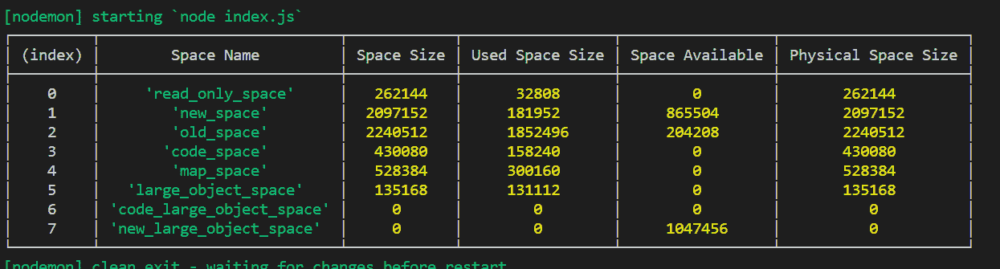

# node . js V8 . getheapspace statistics()方法

> 原文:[https://www . geesforgeks . org/node-js-V8-getheapspace statistics-method/](https://www.geeksforgeeks.org/node-js-v8-getheapspacestatistics-method/)

**v8.getHeapSpaceStatistics()方法**是 v8 模块的内置应用编程接口，用于获取从 v8 版本派生的堆空间的统计信息。

**语法:**

```
v8.getHeapSpaceStatistics();
```

**参数:**该方法没有任何参数。

**返回值:**这个方法返回一个包含版本 8 堆空间统计信息的对象。返回的对象通常包含多个元素的数组，其中每个元素由以下字段组成:

*   **space_name** :字符串表示堆空间的名称。
*   **space_size** :一个数字代表堆空间大小。
*   **space_used_size** :数字表示已用堆空间大小。
*   **space_available_size** :一个数字，代表可用堆空间大小。
*   **物理 _ 空间 _ 大小**:一个数字，指定物理堆空间大小。

下面的例子说明了 Node.js 中 v8.getHeapSpaceStatistics()方法的使用

**示例 1:** **文件名:index.js**

```
// Accessing v8 module
const v8 = require('v8');

// Calling v8.getHeapSpaceStatistics() 
console.log(v8.getHeapSpaceStatistics());
```

使用以下命令运行 **index.js** 文件:

```
node index.js
```

**输出:**

```
[ { space_name: 'read_only_space',
    space_size: 524288,
    space_used_size: 35208,
    space_available_size: 480376,
    physical_space_size: 524288 },
  { space_name: 'new_space',
    space_size: 2097152,
    space_used_size: 975376,
    space_available_size: 55792,
    physical_space_size: 2097152 },
  { space_name: 'old_space',
    space_size: 2330624,
    space_used_size: 2272448,
    space_available_size: 184,
    physical_space_size: 2330624 },
  { space_name: 'code_space',
    space_size: 1048576,
    space_used_size: 571968,
    space_available_size: 0,
    physical_space_size: 1048576 },
  { space_name: 'map_space',
    space_size: 536576,
    space_used_size: 344784,
    space_available_size: 0,
    physical_space_size: 536576 },
  { space_name: 'large_object_space',
    space_size: 0,
    space_used_size: 0,
    space_available_size: 1520180736,
    physical_space_size: 0 } ]

```

**示例 2:** **文件名:index.js**

```
// Accessing v8 module
const v8 = require('v8');

// Calling v8.getHeapSpaceStatistics() 
stats = v8.getHeapSpaceStatistics();

var myList = []
for (var i = 0; i < stats.length; i++){    
  var element = stats[i];

  myList.push({ "Space Name": element['space_name'], 
  "Space Size": element['space_size'], 
  "Used Space Size": element['space_used_size'], 
  "Space Available": element['space_available_size'], 
  "Physical Space Size":element['physical_space_size'] },  
  );
}

// Printing in tabular form
console.table(myList)
```

使用以下命令运行 **index.js** 文件:

```
node index.js
```

**输出:**


**参考:**T2】https://nodejs.org/api/v8.html#v8_v8_getheapspacestatistics