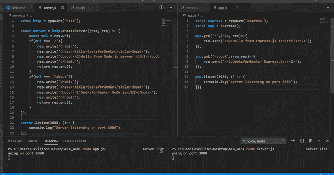
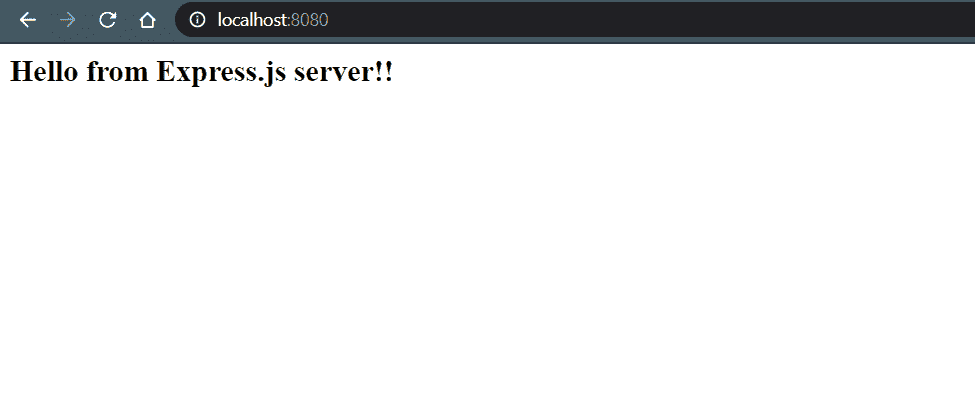
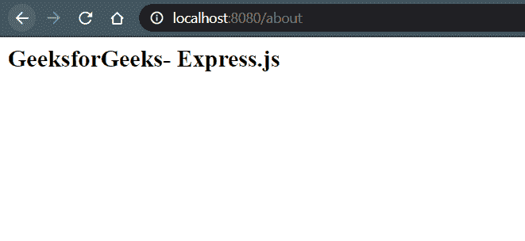

# Node.js vs Express.js

> 原文:[https://www.geeksforgeeks.org/node-js-vs-express-js/](https://www.geeksforgeeks.org/node-js-vs-express-js/)

**[Node.js:](https://www.geeksforgeeks.org/introduction-to-nodejs/)** Node.js 是一个开源的跨平台运行时环境，用于在浏览器之外执行 JavaScript 代码。你需要记住 NodeJS 不是一个框架，也不是一种编程语言。大多数人都很困惑，明白这是一个框架或者一种编程语言。我们经常使用 Node.js 来构建后端服务，比如像 Web App 或者移动 App 这样的 API。贝宝、优步、网飞、沃尔玛等大公司都在生产中使用。

**[Express . js:](https://www.geeksforgeeks.org/introduction-to-express/)**Express 是一个小框架，位于 Node.js 的 web 服务器功能之上，用于简化其 API 并添加有用的新功能。它使得用中间件和路由来组织应用程序的功能变得更加容易。它为 Node.js 的 HTTP 对象添加了有用的实用程序。它方便了动态 HTTP 对象的呈现。

**node . js 和 Express.js 的区别:**

*   Node.js 是一个用于构建 i/o 应用程序的平台，这些应用程序是服务器端事件驱动的，并且使用 JavaScript 制作。
*   Express.js 是一个基于 Node.js 的框架，用于使用 Node.js.event-driven 的方法和原理构建 web 应用程序。

<figure class="table">

| **功能** | **快递** | **Node.js** |
| 使用 | 它被用来使用 Node.js 的方法和原理构建网络应用程序 | 它用于构建服务器端、输入输出、事件驱动的应用程序。 |
| 特征等级 | 比 Node.js 更多的特性 | 功能更少。 |
| 积木 | 它是建立在 Node.js 上的 | 它建立在谷歌的 V8 引擎上。 |
| 写于 | Java Script 语言 | c，C++，JavaScript |
| 框架/平台 | 基于 Node.js 的框架 | 为服务器端执行 JavaScript 而设计的运行时平台或环境。 |
| 控制器 | 提供控制器。 | 不提供控制器。 |
| 按指定路线发送 | 提供了路由。 | 未提供路由。 |
| 中间件 | 使用中间件在服务器端系统地安排功能。 | 不使用这样的条款。 |
| 编码时间 | 它需要更少的编码时间。 | 它需要更多的编码时间。 |

</figure>

**示例:**下面的比较显示了相同的代码在 Node.js(左标签代码)和 Express.js(右标签代码)中是如何不同地编写的。

**注**:这些代码包含在下面的比较中。



**在 node . js&express . js**
**1 中启动服务器。服务器:**使用以下命令安装 Express:

```js
npm install --save express
```

**文件名:index.js**

## java 描述语言

```js
// Requiring the module
const express = require('express');
const app = express();

// Route handling
app.get('/', (req, res) => {
    res.send('<h2>Hello from Express.js server!!</h2>');
});

// Server setup
app.listen(8080, () => {
    console.log('server listening on port 8080');
});
```

使用以下命令运行 **index.js** 文件:

```js
node index.js
```

**输出:**



**2。Node.js 服务器:**需要使用以下代码的 **http** 模块:

```js
const http = require('http');
```

**文件名:index.js**

## java 描述语言

```js
// Requiring the module
const http = require('http');

// Creating server object
const server = http.createServer((req, res) => {
    res.setHeader('Content-Type', 'text/html');
    res.write('<html>');
    res.write('<head><title>GeeksforGeeks</title><head>');
    res.write('<body><h2>Hello from Node.js server!!</h2></body>');
    res.write('</html>');
    res.end();
});

// Server setup
server.listen(3000, ()=> {
    console.log("Server listening on port 3000")
});
```

使用以下命令运行 **index.js** 文件:

```js
node index.js
```

**输出:**


**节点内路由&快递**T2**1。快递路线**:

*   提供了路由&实现很容易。
*   我们可以直接将路由名称和功能传递给 express 的内置功能，将请求类型称为 get、post。

**文件名:index.js**

## java 描述语言

```js
// Requiring module
const express = require('express');
const app = express();

// Handling '/' request
app.get('/', (req, res) => {
    res.send('<h2>Hello from Express.js server!!</h2>');
});

// Handling '/about' request
app.get('/about', (req,res) => {
    res.send('<h2>GeeksforGeeks- Express.js</h2>');
});

// Server setup
app.listen(8080, () => {
    console.log('server listening on port 8080');
});
```

使用以下命令运行 **index.js** 文件:

```js
node index.js
```

打开浏览器，进入**http://localhost:8080/关于**，输出如下:



**2。节点. js 中的路由:**

*   未提供路由。
*   我们必须在发送响应时检查请求的网址和方法。

**文件名:index.js**

## java 描述语言

```js
// Requiring the module
const http = require('http');

// Creating server object
const server = http.createServer((req, res) => {
    const url = req.url;

    if(url === '/') {
        res.write('<html>');
        res.write(
'<head><title>GeeksforGeeks</title><head>');
        res.write(
'<body><h2>Hello from Node.js server!!</h2></body>');
        res.write('</html>');
        return res.end();
    }

    if(url === '/about') {
        res.write('<html>');
        res.write(
'<head><title>GeeksforGeeks</title><head>');
        res.write(
'<body><h2>GeeksforGeeks- Node.js</h2></body>');
        res.write('</html>');
        return res.end();
    }
});

// Server setup
server.listen(3000, () => {
    console.log("Server listening on port 3000")
});
```

使用以下命令运行 **index.js** 文件:

```js
node index.js
```

打开浏览器，进入**http://localhost:3000/关于**，输出如下:

