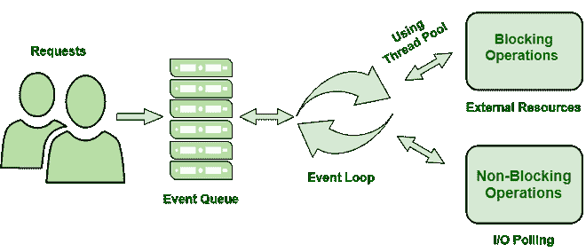

# Node.js Web 应用架构

> 原文:[https://www . geesforgeks . org/node-js-web-application-architecture/](https://www.geeksforgeeks.org/node-js-web-application-architecture/)

Node.js 是一个基于 JavaScript 的平台，主要用于创建 I/O 密集型的 web 应用，如聊天应用、多媒体流网站等。它建立在谷歌 Chrome 的 V8 JavaScript 引擎上。web 应用程序是运行在服务器上的软件，由通过互联网访问应用程序所有资源的客户端浏览器呈现。

**典型的 web 应用程序由以下组件组成:**

*   **客户端:**客户端是指通过发出请求与服务器进行交互的用户。
*   **服务器:**服务器负责接收客户端请求，执行适当的任务，并将结果返回给客户端。它充当前端和存储数据之间的桥梁，允许客户端对数据执行操作。
*   **数据库:**数据库是存储 web 应用程序数据的地方。根据客户端的请求，可以创建、修改和删除数据。

**Node.js 服务器架构:**为了管理多个并发客户端，Node.js 采用了“单线程事件循环”设计。在 Node.js 处理模型中采用了基于 JavaScript 事件的模型和 JavaScript 回调机制。它采用了两个基本概念:

1.  异步模型
2.  不阻塞输入/输出操作

这些特性增强了 Node.js web 应用程序的可伸缩性、性能和吞吐量。

**node . js 架构的组件:**

*   **请求:**根据用户需要执行的操作，对服务器的请求可以是阻塞的(复杂的)或非阻塞的(简单的)。
*   **Node.js 服务器:**node . js 服务器接受用户请求，进行处理，并将结果返回给用户。
*   **事件队列:**事件队列的主要用途是存储传入的客户端请求，并按顺序将其传递给事件循环。
*   **线程池:**node . js 服务器中的线程池包含可用于执行处理请求所需操作的线程。
*   **事件循环:**事件循环从事件队列接收请求，并将响应发送给客户端。
*   **外部资源:**为了处理阻塞的客户端请求，使用外部资源。它们可以是任何类型(计算、存储等)。

**Nodejs 服务器的工作流程:**

*   用户向服务器发送请求(阻塞或非阻塞)以执行操作。
*   请求首先在服务器端进入事件队列。
*   事件队列将请求顺序传递给事件循环。事件循环检查请求的性质(阻塞或非阻塞)。
*   事件循环处理不需要外部资源的非阻塞请求，并将响应返回给相应的客户端
*   对于阻塞请求，通过使用外部资源为完成任务的进程分配一个线程。
*   操作完成后，请求被重定向到事件循环，事件循环将响应传递回客户端。

**优势:**

*   通过使用事件队列和线程池，Node.js 服务器可以高效地处理大量请求。
*   不需要建立多个线程，因为事件循环一次处理一个请求，因此一个线程就足够了。
*   向 Node.js 服务器提供请求的整个过程消耗较少的内存和服务器资源，因为一次只能处理一个请求。