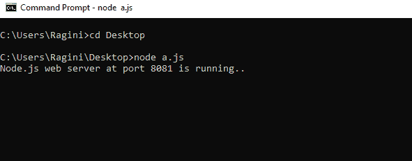
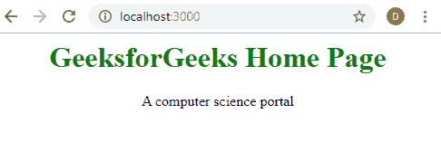
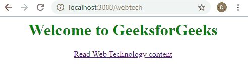
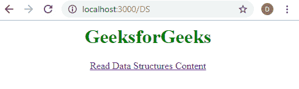
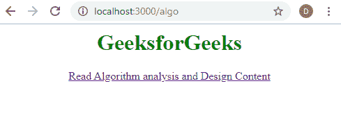

# Node.js 网络服务器

> 原文:[https://www.geeksforgeeks.org/node-js-web-server/](https://www.geeksforgeeks.org/node-js-web-server/)

**什么是 Node.js？**
Node.js 是一个开源的服务器环境。Node.js 在服务器上使用 JavaScript。web 服务器的任务是在服务器上打开一个文件，并将内容返回给客户端。

Node.js 有一个名为 HTTP 的内置模块，它允许 Node.js 通过超文本传输协议(HTTP)传输数据。HTTP 模块可以创建一个 HTTP 服务器，该服务器监听服务器端口并将响应返回给客户端。

**示例:**

```
// Import the Node.js http module
var http = require('http'); 

// req is the request object which is
// coming from the client side
// res is the response object which is going
// to client as response from the server

// Create a server object
http.createServer(function (req, res) {

// 200 is the status code which means
// All OK and the second argument is
// the object of response header.
res.writeHead(200, {'Content-Type': 'text/html'}); 

    // Write a response to the client
    res.write('Congrats you have a created a web server');

    // End the response
    res.end();

}).listen(8081); // Server object listens on port 8081

console.log('Node.js web server at port 8081 is running..')
```

当客户端转到 *http://localhost:8081* 时，将执行 **http.createServer()** 中传递的函数。

**运行代码的步骤:**

*   将上述代码保存在带有*的文件中。js* 分机
*   打开命令提示符，使用 *cd* 命令转到文件所在的文件夹。
*   运行命令**节点*文件名*。js**
*   打开浏览器，转到 URL*http://localhost:8081*



当浏览器中打开 http://localhost:8081 时。


**http.createServer()** 方法包括可用于获取当前 http 请求信息的请求对象，例如 url、请求头和数据。

下面的例子演示了如何在 Node.js 中处理 HTTP 请求和响应

```
// Import Node.js core module i.e http
var http = require('http');

// Create web server
var server = http.createServer(function (req, res) {  

    // Check the URL of the current request
    if (req.url == '/') {

        // Set response header
        res.writeHead(200, { 'Content-Type': 'text/html' }); 

        // Set response content    
        res.write(
          `<html><body style="text-align:center;">
            <h1 style="color:green;">GeeksforGeeks Home Page</h1>
            <p>A computer science portal</p>
            </body></html>`);
        res.end();//end the response

    }
    else if (req.url == "/webtech") {

        res.writeHead(200, { 'Content-Type': 'text/html' });
        res.write(`
          <html><body style="text-align:center;">
            <h1 style="color:green;">Welcome to GeeksforGeeks</h1>
            <a href="https://www.geeksforgeeks.org/web-technology/">
              Read Web Technology content
            </a>
          </body></html>`);
        res.end();//end the response

    }
    else if (req.url == "/DS") {

        res.writeHead(200, { 'Content-Type': 'text/html' });
        res.write(`<html><body style="text-align:center;">
          <h1 style="color:green;">GeeksforGeeks</h1>
          <a href="https://www.geeksforgeeks.org/data-structures/">
            Read Data Structures Content
          </a>
        </body></html>`);
        res.end(); //end the response

    }
    else if (req.url == "/algo") {

      res.writeHead(200, { 'Content-Type': 'text/html' });
      res.write(`<html><body style="text-align:center;">
        <h1 style="color:green;">GeeksforGeeks</h1>
        <a href="https://www.geeksforgeeks.org/fundamentals-of-algorithms/">
          Read Algorithm analysis and Design Content
        </a>
      </body></html>`);
      res.end(); //end the response

  }
    else
        res.end('Invalid Request!'); //end the response

// Server object listens on port 8081
}).listen(3000, ()=>console.log('Server running on port 3000'));
```

在上面的示例中，req.url 用于检查当前请求的 url，并基于此发送响应。
**命令运行代码:**

> **节点索引. js**

**输出:**

*   **URL:localhost:3000**
    
*   **URL:localhost:3000/web tech**
    
*   **URL:localhost:3000/ds**
    
*   **URL:localhost:3000/something**
    