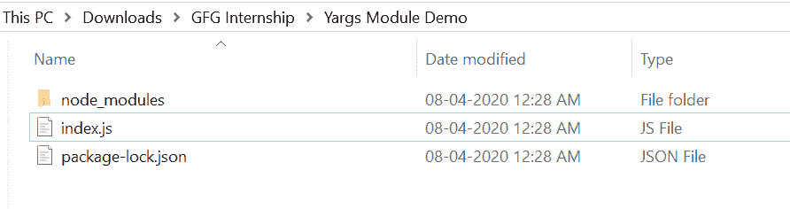
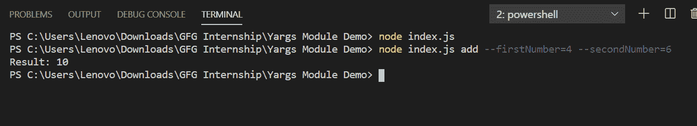

# Node.js Yargs 模块

> 原文:[https://www.geeksforgeeks.org/node-js-yargs-module/](https://www.geeksforgeeks.org/node-js-yargs-module/)

Yargs 模块用于在 node.js 中创建您自己的命令行命令，并有助于生成优雅的用户界面。该模块使命令行参数灵活且易于使用。

**yargs 模块安装:**

1.  您可以访问链接[安装 yargs 模块](https://www.npmjs.com/package/yargs)。您可以使用此命令安装此软件包。

    ```js
    npm install yargs
    ```

2.  安装 yargs 后，您可以使用命令在命令提示符下检查您的 yargs 版本。

    ```js
    npm version yargs
    ```

3.  之后，您可以创建一个文件夹并添加一个文件，例如 index.js。

    ```js
    node index.js
    ```

**文件名:index.js**

```js
const yargs = require('yargs')

// Customize yargs version
yargs.version('1.1.0')

// Create add command
yargs.command({
    command: 'add',
    describe: 'Adds two number',
    builder: {
        firstNumber: {
            describe: 'First Number',
            demandOption: true,  // Required
            type: 'number'     
        },
        secondNumber: {  
            describe: 'Second Number',
            demandOption: true,
            type: 'number'
        }
    },

    // Function for your command
    handler(argv) {
        console.log("Result:", 
            (argv.firstNumber+argv.secondNumber))
    }
})

yargs.parse() // To set above changes
```

**运行程序的步骤:**

1.  项目结构会是这样的:
    
2.  确保您已经使用以下命令安装了 express 和 yargs 模块:

    ```js
    npm install express
    npm install yargs
    ```

3.  Run index.js file using below command:

    ```js
    node index.js
    ```

    运行上述命令后，现在 yargs 命令已设置，您可以如下所示使用它:

    ```js
    node index.js add --firstNumber=4 --secondNumber=10
    ```

    

这就是如何使用 yargs 模块来生成自己的命令行参数命令，从而使它更具交互性。