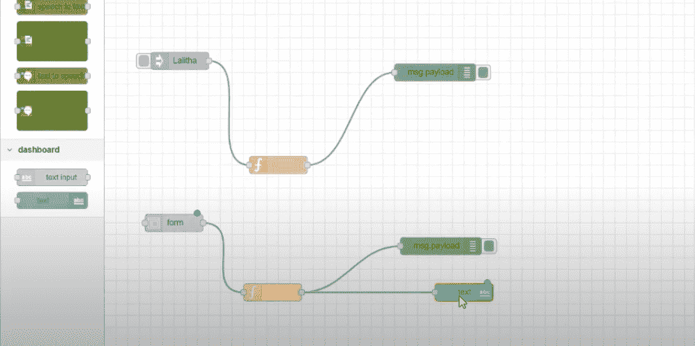
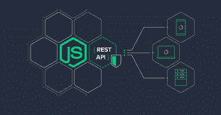

# 节点-红色

> 原文:[https://www.geeksforgeeks.org/node-red/](https://www.geeksforgeeks.org/node-red/)

NODE-RED 是一个基于流的可视化编程高级工具，基本上它的主要焦点是连接物联网的可视化设备。这种编程工具是为以新颖有趣的方式将设备配件(硬件)、应用编程接口和在线管理连接在一起而开发的。

**由:** 开发起初，它是由 IBM 新兴技术组织开发的，是一款免费的源码编程工具。

**开发者:**

*   尼克·奥利里
*   戴夫·康威-琼斯

**最新版本:** v1.0.6 (npm) **编写人:JavaScript**

NODE-RED 流通过在集线器之间传递消息来工作。NODE-RED 中的消息是简单的 JavaScript 对象，可以有任何属性安排。

**安装红色节点**

*   **Installing with npm (Node package manager)**

    ```js
    sudo npm install -g --unsafe-perm node-red
    ```

    如果已经将 Node-RED 安装为全局 npm 包，可以使用以下命令升级到最新版本:

    ```js
    sudo npm install -g --unsafe-perm node-red
    ```

*   **安装码头工人**T0】

*   **安装带卡扣**T0】

**运行节点-红色:**

当 Node-RED 建立和入门整理完成后，即可使用。运行 NODE-RED 的三种方式:

1.  本地
2.  在设备上
3.  在识别的云环境中

**使用 NODE-RED 的首要原因:**
**基于浏览器的流量编辑:** 

它提供了一个基于浏览器的编辑器，可以轻松地使用调色板中的各种节点将流连接在一起，只需单击一下就可以将其部署到运行时。

**用 JavaScript 编写:**


因此，它是用 javascript 构建的，然后 NODE-RED 利用了这种语言的所有优点，即基于事件的编程语言、过程编程能力、平台无关性，除此之外，它相对快速且易于学习。

**在各种操作系统上轻松运行:** Raspbian、Ubuntu、Windows、Docker、Debian、macOS 等

**不仅仅是物联网:** 它通过展示传感器、摄像头和远程开关等物联网小工具之间的使用，增加了物联网领域的巨大认可。在物联网之外，当有人想设计任何创造性的功能时，它可以容纳这么多现成的节点。

**云及预装设备列表:**


NODE-RED 让它完美地运行在系统边缘的最省力的设备上。例如，树莓皮以及云中。

**云有:**

1.  IBM 云
2.  老师弗雷德
3.  亚马逊网络服务
4.  微软 Azure

**预装设备:**

1.  树莓皮
2.  比格犬骨黑
3.  与 Arduino 交互
4.  安卓

**节点类型:**
**注入节点:**

*   该节点允许手动激活流。
*   它鼓励我们在预定的时间内注入各种场合。

**【调试节点:** 该节点有助于显示消息的实质内容——有效负载或整个项目。

**模板节点:** 根据小胡子布局调整产量。

**有各种输入、输出和功能节点:**

<figure class="table">

| **Input node** | **Output node** | **function node** |
| HTTP 响应 | Function |
|  |

</figure>