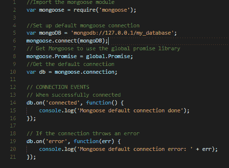
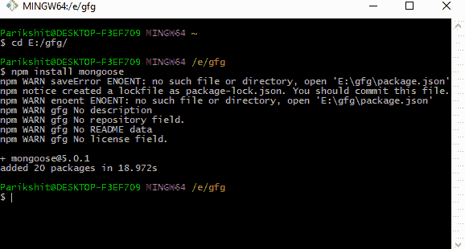
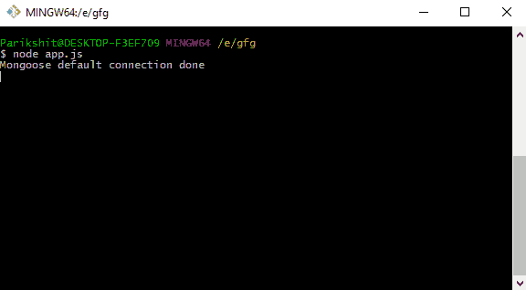

# Nodejs–使用 MongooseJS

将 MongoDB 与 Node 应用程序连接

> 原文:[https://www . geesforgeks . org/nodejs-connect-MongoDB-node-app-using-mongoosejs/](https://www.geeksforgeeks.org/nodejs-connect-mongodb-node-app-using-mongoosejs/)

使用 MongooseJS 将 MongoDB 数据库连接到我们的 NodeJS 应用程序

在我们深入研究 mongoDB 如何使用 mongooseJS 与 nodejs 应用程序连接之前，让我们简单介绍一下这些主导当今网络开发领域的技术。

**Node** : Node.js (Node)是一个在服务器端执行 JavaScript 代码的开源开发平台。节点对于开发需要从浏览器到服务器的持久连接的应用程序非常有用，通常用于实时应用程序，如聊天、新闻提要和网络推送通知。
可以从[这里](https://nodejs.org/en/)下载。

**mongoDB** : MongoDB 是一个跨平台、开源的面向文档的数据库，是 NoSQL 数据库的一种。作为一个 NoSQL(不仅仅是 SQL)数据库，MongoDB 避开了关系数据库的基于表的结构，以适应具有动态模式的类似 JSON 的文档，它称之为 BSON(Binary JSON)。解释这些术语的含义并不是本文的目的，但这里是一个简短的展望

**MongooseJS** : Mongoose 或 MongooseJS 是一个 MongoDB 对象建模(ODM)工具，旨在异步环境下工作。基本上，它是一个包，我们将使用它来与 nodeJS 应用程序中的 MongoDB 数据库进行交互(查询、更新、操作)。我们会在我们的应用程序中安装或“要求”mongooseJS 与 NPM(节点打包管理器)。

**NPM** :节点包管理器或者 NPM 是 nodeJS 应用的官方包管理器。它将与 NodeJS 一起安装。它从命令行或终端使用(取决于所使用的操作系统)。

现在我们已经熟悉了这些技术的基本定义，让我们深入研究一下代码及其解释。
在这种情况下，我们的 nodejs 应用程序(出于演示目的)将是一个单独的 javascript 文件。姑且称之为 **app.js** 。继续，并在新文件夹中创建该文件。

nodejs 应用程序的源代码。

**Source code explanation:**

**第 2 行**:在我们的 app 中‘需要’或者导入猫鼬包。

**第 4 行**:它将连接字符串(包含与数据库连接的信息)分配给我们的 mongoDB 变量。

**第 6 行**:这些行有助于建立或“打开”或启动与 mongoDB 变量中提到的数据库的连接。mongoose.connect()函数的第一个参数是连接字符串(mongoDB 变量)。

**第 10 行**:mongous . connect()函数将数据库的连接作为**mongous . connection**返回，我们将其分配给 db 变量。

**第 14 行**:当连接到数据库并返回时，该行将消息记录到控制台中。它监听“连接”事件，当事件触发时，由第 14、15、16 行组成的函数()被执行。

**第 19 行**:当连接到数据库并返回时，该行将消息记录到控制台中。它监听“错误”事件，当事件触发时，由第 19、20、21 行组成的函数()被执行。

写完源代码后，打开一个终端或命令提示符(如果是 windows 用户)并导航到您的项目目录。然后编写命令 **npm 安装 mongoouse**如下图所示:

该命令安装猫鼬软件包，以便在应用程序中使用

The above command will create a ‘node_modules’ folder in your current directory or folder and download the necessary files there.
If you are following until now, all the preparation is done and now we can test our connection to database.
Write **node app.js** to start the app.

node app.js 命令运行我们的应用程序。db.on('connected ')事件触发，函数执行。