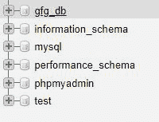

# NodeJS MySQL 创建数据库

> 原文:[https://www.geeksforgeeks.org/nodejs-mysql-create-database/](https://www.geeksforgeeks.org/nodejs-mysql-create-database/)

**简介:**

我们将看到如何在 nodejs 中创建和使用 mysql 数据库。我们将借助 **CREATE DATABASE** 查询来实现这一点。

**语法:**

```
Create Database Query: CREATE DATABASE gfg_db;

Use Database Query: USE gfg_db
```

**模块:**

*   NodeJs(节点名称)
*   ExpressJs
*   关系型数据库

**设置环境和执行:**

4.  **创建项目**

    ```
    npm init
    ```

5.  **安装模块**

    ```
    npm install express
    npm install mysql
    ```

6.  **创建并导出 *mysql* 连接对象。**

    ## sqlconnection . js

    ```
    const mysql = require("mysql");

    let db_con  = mysql.createConnection({
        host: "localhost",
        user: "root",
        password: ''
    });

    db_con.connect((err) => {
        if (err) {
          console.log("Database Connection Failed !!!", err);
        } else {
          console.log("connected to Database");
        }
    });

    module.exports = db_con;
    ```

7.  **创建服务器:**

    ## index . js

    ```
    const express = require("express");
    const database = require('./sqlConnection');

    const app = express();

    app.listen(5000, () => {
      console.log(`Server is up and running on 5000 ...`);
    });
    ```

8.  **创建路线创建数据库并使用。**

    ## 爪哇描述语言

    ```
    app.get("/createDatabase", (req, res) => {

        let databaseName = "gfg_db";

        let createQuery = `CREATE DATABASE ${databaseName}`;

        // use the query to create a Database.
        database.query(createQuery, (err) => {
            if(err) throw err;

            console.log("Database Created Successfully !");

            let useQuery = `USE ${databaseName}`;
            database.query(useQuery, (error) => {
                if(error) throw error;

                console.log("Using Database");

                return res.send(
    `Created and Using ${databaseName} Database`);
            })
        });
    });
    ```

9.  **输出:**将此链接放入浏览器*http://localhost:5000/create database*

    ```
    Created and Using gfg_db Database
    ```

    