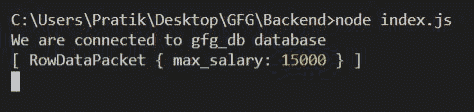
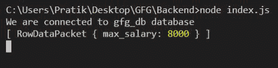

# NodeJS MySQL Max()函数

> 原文:[https://www.geeksforgeeks.org/nodejs-mysql-max-function/](https://www.geeksforgeeks.org/nodejs-mysql-max-function/)

我们将使用 MySQL 中的 **Max()** 函数来获取某个特定列的最大值。

**语法:**

```
MAX(column_name)
```

**参数:** MAX()函数接受单个参数，如上所述，如下所述。

*   **列名:**我们必须从中返回最大值的列名。

**返回值:** MAX()函数返回表中特定列的最大值。

**模块安装:**使用以下命令安装 MySQL 模块。

```
npm install mysql
```

**数据库:**我们的带有样本数据的 SQL 发布者表预览如下所示。
T3】

**例 1:**

## idex.js(消歧义)

```
const mysql = require("mysql");

let db_con  = mysql.createConnection({
    host: "localhost",
    user: "root",
    password: '',
    database: 'gfg_db'
});

db_con.connect((err) => {
    if (err) {
      console.log("Database Connection Failed !!!", err);
      return;
    }

    console.log("We are connected to gfg_db database");

    // here is the query
    let query = "SELECT MAX(salary) AS max_salary FROM publishers";

    db_con.query(query, (err, rows) => {
        if(err) throw err;

        console.log(rows);
    });
});
```

**输出:**



**例 2:**

## index.js

```
const mysql = require("mysql");

let db_con  = mysql.createConnection({
    host: "localhost",
    user: "root",
    password: '',
    database: 'gfg_db'
});

db_con.connect((err) => {
    if (err) {
      console.log("Database Connection Failed !!!", err);
      return;
    }

    console.log("We are connected to gfg_db database");

    // here is the query
    let query = "SELECT MAX(salary) AS max_salary 
                 FROM publishers WHERE id < 8";

    db_con.query(query, (err, rows) => {
        if(err) throw err;

        console.log(rows);
    });
});
```

**输出:**

