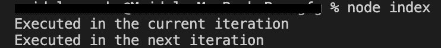

# NodeJS process.nextTick()方法

> 原文:[https://www . geesforgeks . org/nodejs-process-next tick-method/](https://www.geeksforgeeks.org/nodejs-process-nexttick-method/)

流程对象是 NodeJS 核心 API 提供的少数全局对象之一。它可以从任何地方访问，因此它的方法也可以被访问。这就是一种叫做 **process.nextTick()** 的方法，实时应用中的开发人员每天都在使用这种方法，将函数的执行推迟到下一次事件循环迭代。

**语法:**

```
process.env
```

**返回值:**

在代码片段中，第二个控制台首先被打印，因为这是事件循环当前迭代的一部分，第一个控制台是回调函数的一部分，该回调函数与事件循环下一次迭代中执行的 **process.nextTick()** 相关联。

下面的例子说明了在 NodeJS 中 process.nextTick()属性的使用:

**示例:**

## java 描述语言

```
// Node.js program to demonstrate the 
// process.nextTick() Property 

// Include process module 
const process = require('process');

process.nextTick(() => {
  console.log('Executed in the next iteration');
});

console.log('Executed in the current iteration');
```

**运行命令:**

```
node filename
```

**输出:**

