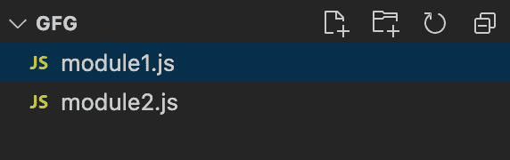
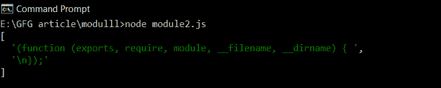
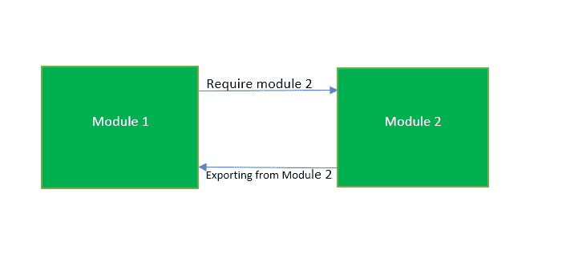
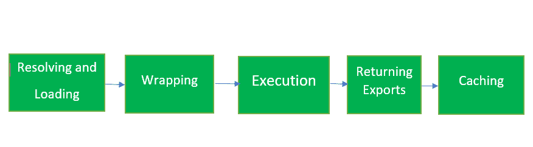

# Node.js 需要模块

> 原文:[https://www.geeksforgeeks.org/nodejs-require-module/](https://www.geeksforgeeks.org/nodejs-require-module/)

在**节点 JS** 中，每个 JavaScript 文件都被视为一个独立的模块。使用**通用**模块系统:**要求()**、**导出**和**模块，导出**。

**require()** 模块导出的主对象是一个函数。当节点以文件路径作为函数唯一参数调用 require()函数时，节点会经历以下步骤序列:

1.  解析和加载
2.  包装材料
3.  执行
4.  出口退货
5.  贮藏

让我们更详细地看看每一步。

*   **解析和加载:**在此步骤中，节点使用以下步骤决定加载核心模块或开发人员模块或第三方模块:
    *   当要求函数接收模块名称作为其输入时，它首先尝试加载**核心模块。**
    *   如果要求功能中的路径以**开头。/'** 或**../'** 会尝试加载开发者模块。
    *   如果找不到文件，它将尝试查找包含 index.js 的文件夹。
    *   否则将转到 **node_modules/** 并尝试从这里加载模块。
    *   如果仍未找到文件，则会引发错误。
*   **包装:**一旦模块被加载，模块代码就被包装在一个特殊的函数中，该函数将允许访问几个对象。

**文件夹结构:**


**例 1:**

## module2.js

```js
// Caching
const mod = require('./module1.js')
```

## module1.js

```js
console.log(require("module").wrapper);
```

**输出:**

```js
[
  '(function (exports, require, module, __filename, __dirname) { ',
  '\n});'
]
```



*   **执行:**在这部分，模块的代码或者包装器函数内部的代码由 NodeJS 运行时运行。
*   **Returning Exports:** In this part, require function return the **exports** of required module. These exports are stored in **module.exports.**

    使用 module.exports 导出单个变量/类/函数。如果要导出多个函数或变量，使用**导出** ( exports.add = (a，b)= > a+b)。

    

    出口退货

*   **缓存:**最后，所有模块在第一次加载后都会被缓存，例如，如果你多次要求相同的模块，你会得到相同的结果。因此，代码和模块在第一次调用中执行，在随后的调用中，从缓存中检索结果。

**示例 2:** 让我们举个例子来理解缓存

## module1.js

```js
console.log("Hello GEEKSFORGEEKS");
module.exports  = ()=> console.log("GeeksForGeeks is the best !!");
```

## module2.js

```js
// Caching
const mod = require('./module1.js');
mod();
mod();
mod();
```

**输出:**

```js
Hello GEEKSFORGEEKS
GeeksForGeeks is the best !!
GeeksForGeeks is the best !!
GeeksForGeeks is the best !!
```



当我们在节点 js 中需要()一个模块时会发生什么